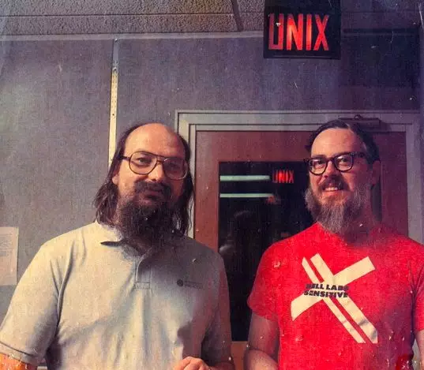
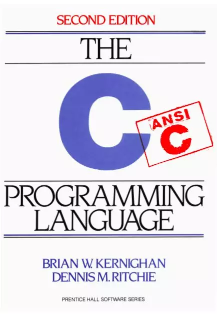

## C 的起源
1969 年贝尔实验 Ken Thompson 和 Dennis Ritchie 的 Kpi 项目 Multics （多路复用信息和计算机系统）停工。闲着无事，Ken Thompson 曾经为 MULTICS 写了一个「Space Travel」的游戏，在 MULTICS 上经过实际运行后，他发现游戏速度很慢而且耗费昂贵 —— 每次运行会花费75美元。为了能在公司闲置的低配的电脑玩他喜欢的星际旅行，趁他老婆回老家度假期间，拉上 Ritchie，开始写一个操作系统来运行这款游戏，这个操作系统也就是 Unix。

1970 年 Thompson 打造出了 Unix 。自此 Unix 纪元开始，所以 Unix 时间戳从1970年1月1日开始计算。最初的 UNIX 系统就是用汇编语言编写的，而当时的一些应用是由叫做 B语言的解释型语言和汇编语言混合编写的，在移植的过程中遇到不少麻烦。开发 Unix 过程中，Thompson 用 BCPL 语言非常痛苦，发明了 B 语言，后来 Ritchie 觉得 B 语言还是不能满足要求，在 UNIX 的移植方面依然不尽人意，在 B 语言基础做了改进，称之为 C 语言，C 语言也贯彻了 UNIX 大道至简的原则，语法简洁，结构清晰。

接下来 Thompson 和 Ritchie 用 C 语言重构了 Unix 。早期 Unix 源码是随便分享给其他人的，Unix 源码被流传到各个实验室、学校、公司。大家一起研究改进，加速了 Unix 的发展。这也是的 C 语言让大家所熟知。

## C 的发展

为了更方便其他人学习和使用 C 语言，Dennis Ritchie 联合其同事 Brian W.Kernighan 合著《The C Programming Language》成为介绍 C 语言的权威经典著作。

这个时期，C 语言被成为“K&R C”，正式由于 C 语言的流行，大家由于各种不同的原因，开始出现很多 C 语言的编译器，所以就会各自为政添加新的关键字，语法等。所以，一个正式的语言标准是必须的。K&R 最初所做的 C 语言报告用了 40 页，1983 年，ANSI 成立 C 语言工作小组，开始 C 语言的标准化工作，最终 ANSI C 手册超过了 200 页。

《The C Programming Language》出版了第二版，在其附录 A 中详尽说明了 ANSI C 参考手册，具体而言就是：词法规则、语法符号、表达式、声明、语句等等。正如前言里说的，推荐大家将该书常备于手，随时翻阅以便查漏补缺。

附录 B 则总结了 ANSI 标准的函数库。标准库不是 C 语言本身的构成部分，但是支持标准 C 的实现会提供该函数库中的函数声明、类型以及宏定义。如何实现他不负责，比如后来的 GNU 操作系统上写的 glibc 就完全实现了 ANSI C 标准函数库。

