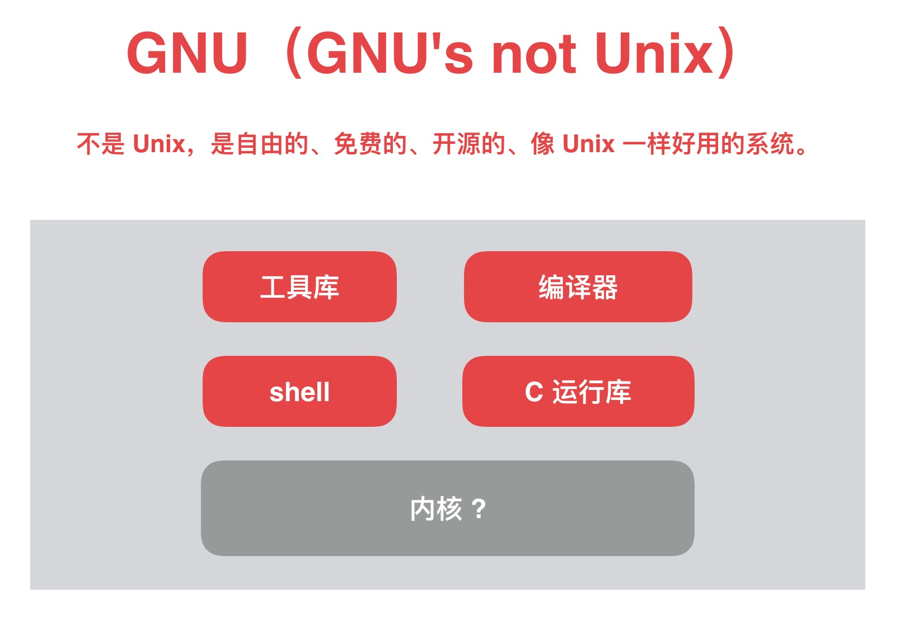

# GNU

## 为什么要谈 GNU

不得不说很多程序员，即使一直做后端开发的同学也不一定知道它的存在。大多数开发人员都是盲人摸象，管中窥豹。只了解语言本身一点特性，并没有了解背后的东西。了解我们软件开发的基础生态对我们平常的开发工作、及时补位、bug 追踪都有很大的帮助。

大家一定用过 `bash` 写过简单的脚本，也应该在服务器上有过以下经历：用 `gcc`，`make` 编译过软件，使用 `gzip`，`tar` 在服务上解压缩过文件，使用 `wget` 访问网络资源，使用 `less` 查看文件。其实他们都是 `GNU` 的软件包。

> GNU软件包文档（按分类排列） https://www.gnu.org/manual/manual.html 

## 极客愤青的 GNU 计划

1983 年，贝尔实验室的母公司 AT&T 发布了 Unix 最新版 System V，宣布从此 Unix 只能商业使用，不再开放源代码。理查德·斯托曼是老牌黑客，Emacs的作者。对 Unix 的收费和闭源非常不爽，于是创建了自由软件基金会（FSF），起草了 GPL 协议。他雄心勃勃地提出了一项伟大的计划，GNU（GNU's not Unix）计划。命名很程序，递归缩写，这个套路，你开发软件命名犯难的时候，也可以用。

Not Unix，不是Unix，是自由的、免费的、开源的、像Unix一样好用的系统。所以 GNU 是一个计划，也是一个操作系统。

起初一起都进展的非常顺利，比如我们现在一直在使用的 Bash Shell， GCC 编译器，GDB 调试工具，Glibc C运行库这些都开发完了。GNU 完成了一大堆的软件之后，但是内核开发一直不能令人满意，没一颗好心脏，再强健的身躯，也没有灵魂。前面说到这些软件为 Linux 内核开发创造了合适环境，促使了 Linux 的诞生。

> 参考 https://www.linuxprobe.com/origin-of-linux.html