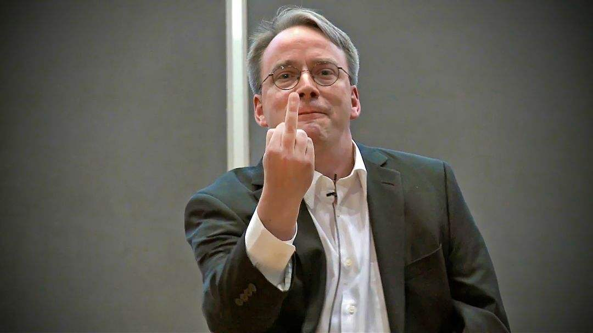
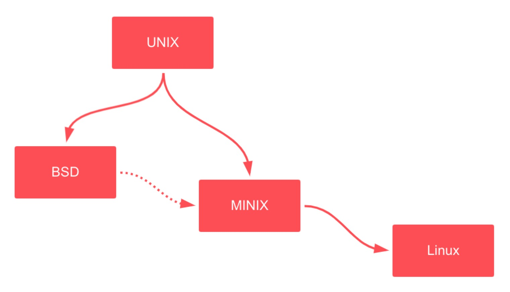

# Linux
## Linux 的诞生



1991 年，垃圾话大王 Linus Torvalds 还是芬兰赫尔辛基大学的一名学生，在学校期间开始折腾 MINIX 操作系统，并且开始在 MINIX-386 系统上运行 GNU GCC，在论坛上回复其他人关于 MINIX 的问题，都以`Read the fucking Source Code :-)`开篇，垃圾话本色初露锋芒。
在 MINIX 的影响之下，GNU C 编译器生态基础上，开发了一个操作系统的内核，因为受 GNU 影响，在发布 Linux 的时候选择了 GPL 协议。然后发布在 MINIX 论坛上，因为互联网的存在，大家得以纷纷加入到其中开发。

另一方面，受益于 Unix ，IEEE 和 ISO/IEC 基于在 Unix 上的实践经验抽象出一套操作系统的调用服务接口 - POSIX ，便于应用程序在不同操作系统之间的可移植性。Linux 在早期版本中就为 POSIX 标准做了准备工作，在源码 `linux-0.11/include/unistd.h` 中还可以看到
```c
#ifndef _UNISTD_H
#define _UNISTD_H

/* ok, this may be a joke, but I'm working on it */
...
int getpid(void);
...
#endif
```

linux 的成功与 linus 的聪明才智、极客精神密不可分，同时也要感谢 MINIX 、Unix 源码帮助、依托 GNU 计划、POSIX 标准和互联网。还有一点天时，就是当时非常优秀的 Unix 分支 BSD 操作系统（ TCP/IP 协议在 Unix 上的实现就是 BSD 上实现的），我们现在使用的 MacOS 就是在其之上发展而来。当时 BSD 与 Unix 一直打官司，错过了最好的发展机会。



## 被大众忽视的 GNU

Linux 是在 GNU 生态最核心的补充，但是因为其是内核，导致大家都忽视了 GNU 只记住 Linux。实际上应该称之为`GNU/Linux`。比如我在服务器上执行

```c
$ uname -a
Linux 10.0.2.15 3.10.0-957.1.3.el7.x86_64 #1 SMP Thu Nov 29 14:49:43 UTC 2018 x86_64 x86_64 x86_64 GNU/Linux
```

本书后面的内容也都是建立在 GNU/Linux 基础之上的，比如我们的 C 编程依赖的标准库是 [glibc](https://www.gnu.org/software/libc/libc.html) 不会考虑 windows 编程的兼容情况。

> 参考 [http://oldlinux.org/](http://oldlinux.org/)