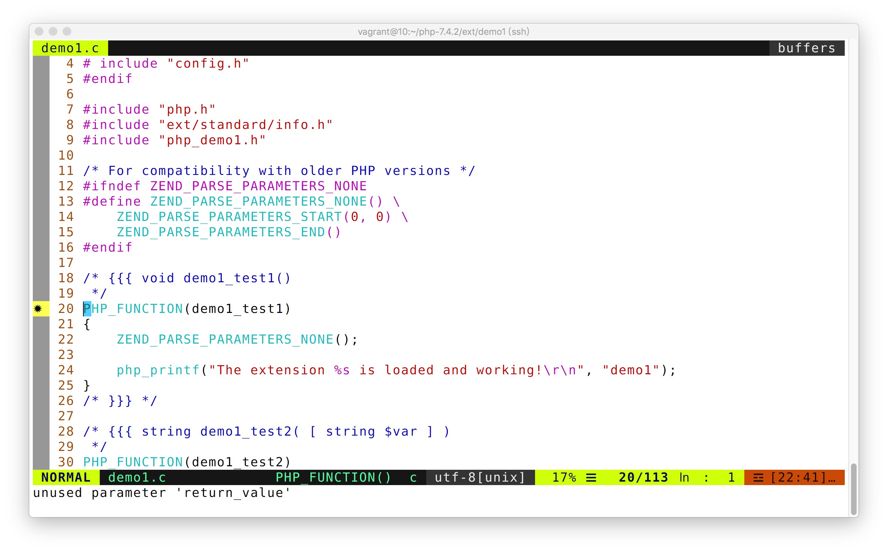

# Vim



作为一个服务端开发人员，如果还不了解 vim ，是不合格的，因为我们必不可少的要远程登录到服务器上执行一些代码或者文本的编辑工作。vim 的操作手册过于庞大，我们了解一些基础的即可。

关于 vim 基础操作这里就不一一赘述了，不太熟悉的朋友可以在网上找资料。如果你对 VIM 不熟悉的话， 最好是在一个 GNU/Linux 操作系统上实操学习一下。

## 自定义 Vim 的不归路

虽然 vim 很强大，但是高级功能使用比较有难度，所以 vim 生态产生了大批量的插件和插件管理软件。比如我们开发大家都希望有自动补全、语法错误提示、代码高亮、代码跳转、代码对齐、代码目录、git 操作等就需要插件的支持。

我尝试走了这条路，花了我很长时间去折腾一套自定义的环境，非常耗时。而且还有各种问题需要解决，最终我选择了一套开源的集成环境，也就是 vimplus，类似的集成软件包还有很多，选择一个自己觉得合适的就好。

如果你是 vim 初学者，也建议你可以尝试自己 DIY 下自己的 vim 对后面使用别人的集成包也有帮助，这里提供一些我使用的资源: 

> - 优秀的插件这里都可以找到 https://vimawesome.com/
> - 插件管理使用 vim-plug  https://github.com/junegunn/vim-plug

然后就是自己折腾了，记得浅尝辄止，不要花太多时间在这上面，毕竟我们的目标是利用工具去写代码，而不是成为一个 vim 骨灰级专家。

## 使用 vimplus

> https://github.com/chxuan/vimplus

使用如下命令安装

```bash
$ git clone https://github.com/chxuan/vimplus.git ~/.vimplus
$ cd ~/.vimplus
# 不加sudo
$ ./install.sh
```

基本上我在 intellij idea 常用的功能都有了，具体各种快捷键，大家可以查看其帮助文档，我的视频教程也是以 vimplus 为项目编辑器。

其他 vim 小技巧会在实际使用场景中以 tips 穿插说明，没有具体场景，先列举出来，印象也不深刻。