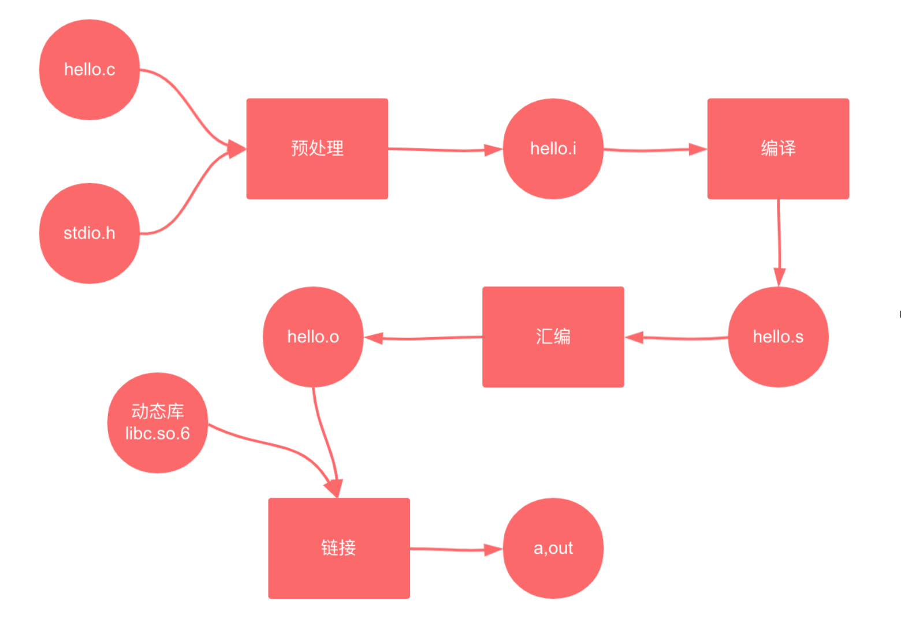

上一节内容中，我们使用的编译器就是`gcc`


`GCC, the GNU Compiler Collection`，应该算是 GNU 最成功的作品了，前面提到 linus 也是使用了该编译器来实现 Linux 内核的编译。GCC 原名为 GNU C 语言编译器（GNU C Compiler），只能处理 C 语言。但其很快扩展，变得可处理 C++，后来又扩展为能够支持更多编程语言，如Fortran、Pascal、Objective -C、Java、Ada、Go以及各类处理器架构上的汇编语言等，所以改名 GNU编译器套件（GNU Compiler Collection）

## 编译 hello world
我们首先通过`gcc`编译器，将源码文件编译生成了默认的`a.out`二进制文件。然后在`bash`里执行命令，`bash`会创建一个子进程运行`./a.out`，输出`hello, world`，然后`bash`子进程退出。
```bash
$ gcc hello.c
$ ./a.out
hello, world
```  


使用`gcc -save-temps hello.c`会保存中间临时文件

gcc 参数很多，这里不做详细说明，在这一章节，我们使用基础的即可
```bash
# gcc -Wall -g -std=gnu99 -o {binname} {filelist...}
$ gcc -Wall -g -std=gnu99 -o test x.c y.c z.c
```

参数|含义
-----|----
-Wall | 输出报错信息
-g | 编译时输出调试信息
-std=gnu99 | 语法上使用 c99 的语法规则
-o x | x 表示编译之后输出的目标文件名，不指定时，默认文件名为 a.out

后面我们会用到更多命令，我们再学习也不迟。

> 这里介绍的一篇内容还比较全 https://www.runoob.com/w3cnote/gcc-parameter-detail.html

比如我们执行该编译命令就会发出警告。

```bash
$ gcc -Wall -g -std=gnu99 -o hello hello.c
hello.c:3:6: 警告：‘main’的返回类型不是‘int’ [-Wmain]
 void main()
      ^
```
提示我们`main`函数的返回值应该是`int`，代码虽然是 K&R C 的经典例子，但随着后面 ANSI 标准的慢慢演进，创始人的代码不符合标准也正常。因为`bash shell`通过子进程的返回值来判断程序运行的结果或者异常状态，所以必须有一个`int`的返回值。