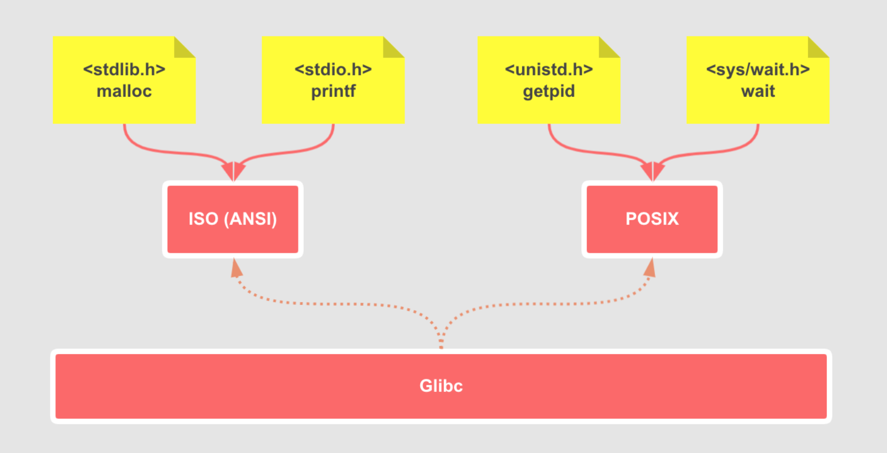

## 了解 glibc
前面我们说到《The C Programming Language》附录 B 总结了 ANSI 标准的函数库。简单来说，美国国家标准协会（ANSI）定义了一些函数头文件，比如我们在`hello.c`中使用的的`printf`属于标准输入输出`stdio.h`。

> C 标准库头文件可以参考 https://zh.cppreference.com/w/c/header 其中标明各头文件是在哪个版本开始启用。

GNU 的开发工程师来负责在 GNU 系统上实现 ANSI 标准的函数库。实现这些函数的项目就是 glibc，当然 glibc 不仅仅实现了 C99 ，也实现了 POSIX 等接口。

https://www.gnu.org/software/libc/libc.html



## libc 、glibc 、Linux libc 的区别
这几个概念，我们入门看书的或者查资料的时候，很容易混淆，下面我们看看官方的解释说明

> 下面这段摘录自 https://man7.org/linux/man-pages//man7/libc.7.html

libc 即美国国家标准协会（ANSI）C语言标准库，**他是一个规范，标准，无具体实现**。

1990 年，因为 glibc 对 Linux 的支持不太好，Linux 内核开发者们就 fork 了 glibc 叫做 `Linux libc`，发布了 2，3，4，5 版本。最后版的共享库文件名是`libc.so.5`。

1997 年 glibc 2.0 发布，由于太过于优秀，各个 linux 发行版纷纷切换回 glibc，为了避免与 Linux libc 版本发生任何冲突，所以在 Linux 系统中后面一直是 libc6，文件名一直是`libc.so.6`。

比如在我服务器上执行
```bash
$ ls -al /usr/lib64 | grep libc.so
-rw-r--r--   1 root root      253 8月   7 2019 libc.so
lrwxrwxrwx   1 root root       12 9月  28 2019 libc.so.6 -> libc-2.17.so
```
实际其链接的是`libc-2.17`，glibc 的布历史可以在 https://sourceware.org/glibc/wiki/Glibc%20Timeline 查看。

## 再看 hello world
再看前面我们用 GCC 编译 `hello.c` 时，实际会默认链接 glibc 动态库

```bash
$ gcc -Wall -g -std=gnu99 hello.c
hello.c:3:6: 警告：‘main’的返回类型不是‘int’ [-Wmain]
 void main()
      ^
$ ldd a.out
	linux-vdso.so.1 =>  (0x00007ffc4ab38000)
	libc.so.6 => /usr/lib64/libc.so.6 (0x00007ff5f7a2d000)
	/lib64/ld-linux-x86-64.so.2 (0x00007ff5f7dfb000)
```
`ldd` 模拟运行一遍 `main`，在运行过程中做动态链接，从而得知这个可执行文件依赖于哪些共享库，每个共享库都在什么路径下，加载到进程地址空间的什么地址。

- `/lib64/ld-linux-x86-64.so.2`是动态链接器，没有它，就无法实现链接动态库的编辑操作
- `/usr/lib64/libc.so.6` 是 glibc 动态库，因为我们使用 printf 函数
- `linux-vdso.so.1` 因为 `glibc` 里 `printf` 函数的实现最终还是依赖系统调用，依赖的 `syscall` 函数在`linux-vdso.so.1`