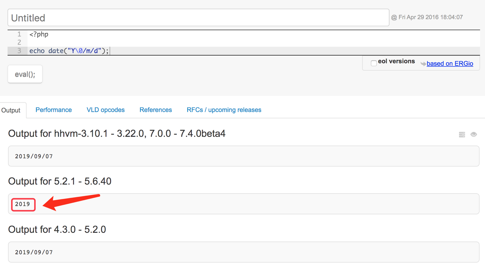

## char 与数组

上节咱们知道 char 是字符，char 数组是不是就是字符串了呢？

```c
#include <stdio.h>

int main(int argc, const char *argv[]) {
    char str[] = {'a', 'b', 'c', 'd'};
 
    for (int i = 0; i < sizeof(str); ++i) {
        printf("%c: ascii 码为 %d\n", str[i], str[i]);
    }

    printf("str: %s\n", str);
 
    return 0;
}
```

`printf %s`表示按字符串输出，而数组的变量名，也是数组的首地址。

编译运行

```bash
a: ascii 码为 97
b: ascii 码为 98
c: ascii 码为 99
d: ascii 码为 100
str: abcd�
```
## 字符串停止符

为什么最后会输出一个乱码？这是因为`str`变量只申请了4个字节的内存，其后面的内存空间存放的数据是不可控的，会继续输出，直到遇到`\0`才会终止。这里引入了一个新的概念，那就是字符串就是一串以`\0`结尾的字符数组。

比如我们将上面的`str`初始化改为
```c
char str[5] = {'a', 'b', 'c', 'd'};
```
上节我们知道申请的内存，不初始化的单元则自动用该数组元素类型的默认值填充，所以会填充`0`，ascii 码`0`对应的不可见字符`\0`。所以字符串在 str[4] 就被终止了。

编译运行
```bash
a: ascii 码为 97
b: ascii 码为 98
c: ascii 码为 99
d: ascii 码为 100
: ascii 码为 0
str: abcd
```
在 ANSI C 标准库里关于字符串的操作都存放在`<string.h>`里，比如计算字符串长度的函数`strlen`，不包含末尾`\0`

```c
#include <stdio.h>
#include <string.h>

int main(int argc, const char *argv[]) {
    printf("%ld\n",strlen("abc"));      //3
    printf("%ld\n",strlen("abc\0"));    //3
    printf("%ld\n",strlen("abc\0d"));   //3
    printf("%ld\n",strlen("abc\0de"));  //3

    return 0;
}
```
可以观察到`\0`及其以后都不在 strlen 的计算范围内，在 C 语言里字符串都以`\0`作为结束符。而字符串中间有`\0`而影响程序逻辑和结果的情况叫非二进制安全。比如 php 在 5.2.1~5.6.4 中间的版本使用`date`函数时，如果中间有`\0`，则会触发 bug ：
```php
echo date("Y\0/m/d");
```
只会输出年份，后面的月份和日期不会输出，在这之前的版本和之后的版本中均没有此问题。说明在这些版本中对字符串的处理没有考虑二进制安全。



## char 数组初始化

初始化 | 内存占用
------- | -------
`char a[] = {'a','b','c','d'};` | 4 
`char b[4] = {"abcd"};` | 4
`char c[4] = "abcd";` | 4
`char d[] = {"abcd"};` | 5
`char e[] = "abcd";` | 5

双引号初始化的时候，如果申请的内存空间够用的情况下，会在末尾放置一个`\0`。

## 思考题

下面的字符串长度是多少
```c
#include <stdio.h>
#include <string.h>

int main(int argc, const char *argv[]) {
    printf("%ld\n",strlen("123\0456"));

    return 0;
}
```