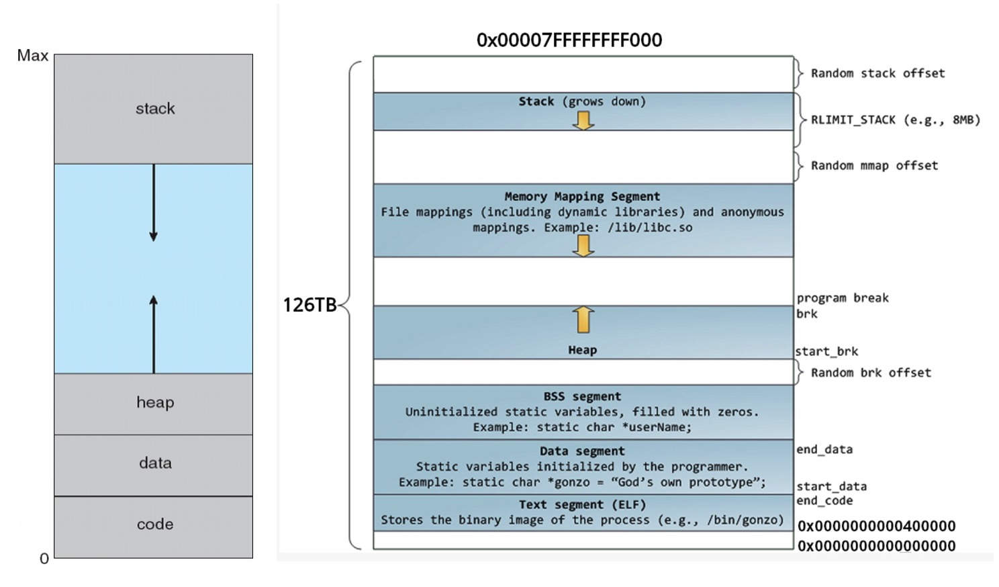

## 虚拟内存管理
每个进程都有**独立**的虚拟地址空间，进程访问的虚拟地址并不是真正的物理地址，我们在代码里打印的地址都是虚拟内存的地址。 现代操作系统普遍采用虚拟内存管理（Virtual Memory Management）机制，将虚拟内存和物理内存做映射。

> 可以重点参考《C专家编程》对内存的思考
> 对虚拟内存的实现原理感兴趣的同学，推荐学习 [哈尔滨工业大学/李治军/《操作系统》](https://www.bilibili.com/video/av70807448/) 

## 进程地址空间


```c
#include <stdio.h>
#include <stdlib.h>

int a[1];
int b = 2;
static int c = 3;
char *d = "4";

int main()
{
    int e = 5;
    static int f = 6;
    char *g = (char *)malloc(10);

    printf("a:%p\n", a);
    printf("b:%p\n", &b);
    printf("c:%p\n", &c);
    printf("d:%p\n", d);
    printf("e:%p\n", &e);
    printf("f:%p\n", &f);
    printf("g:%p,%p\n", &g, g);
    printf("main: %p\n", main);

    free(g);

    return 0;
}
```
编译
```bash
gcc -Wall -g -std=gnu99 4.c
```
我们通过`nm`工具分析编译完文件的符号表
```bash
$ nm -l a.out|grep "4.c"
0000000000601060 B a	/home/vagrant/x/4.c:4
0000000000601048 D b	/home/vagrant/x/4.c:5
000000000060104c d c	/home/vagrant/x/4.c:6
0000000000601050 D d	/home/vagrant/x/4.c:7
00000000004005bd T main	/home/vagrant/x/4.c:9
```

变量   | 地址   | 内存段 | 内存段完整版
----- | ----- | ----- | ----- 
a | 0000000000601060 | B | BSS
b | 0000000000601048 | D | 数据段
c | 000000000060104c | d | 数据段
d | 0000000000601050 | D | 数据段只读区
main | 00000000004005bd | T | 文本段

运行
```bash
a:0x601060
b:0x601048
c:0x60104c
d:0x400730
e:0x7ffce79ada5c
f:0x601058
g:0x7ffce79ada50,0xa01010
main: 0x4005bd
```
我们发现除了堆和栈上的变量，其他的变量在编译完之后，他们的地址确定了。

进程地址空间（不考虑共享库时），由高地址到低地址分别为：

1. 栈：用于维护函数调用的上下文空间
2. 堆：就是平时所说的动态内存
3. BSS 段：存放未初始化的变量
4. 数据段：存放初始化后的全局变量和全局静态变量，字符串常量在数据段的只读区
5. 文本段：可执行文件的指令（代码）

