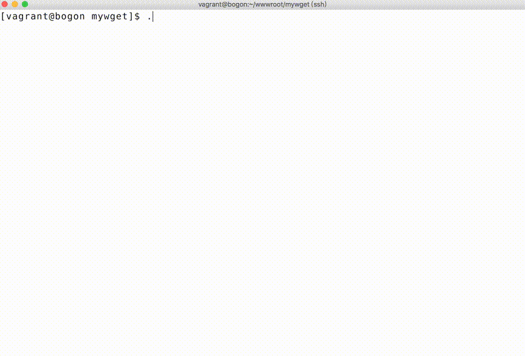

实战小项目的目标就是编写一个`wget`下载`http`资源的软件包
```bash
$ mywget -h
Usage: myget [OPTION]... [URL]...
  -O,  --output-document=FILE  write documents to FILE
  -d,  --debug                 print debug output
  -h,  --help                  display this help and exit
  -V,  --version               output version information and exit
```
```bash
$ mywget -O zss.jpg https://static.mengkang.net/view/images/zs.jpg
HTTP/1.1 200 OK
Server: nginx
Date: Sun, 14 Mar 2021 13:52:04 GMT
Content-Type: image/jpeg
Content-Length: 106667
Last-Modified: Sat, 16 Dec 2017 03:03:48 GMT
Connection: close
ETag: "5a348d14-1a0ab"
Expires: Tue, 13 Apr 2021 13:52:04 GMT
Cache-Control: max-age=2592000
Accept-Ranges: bytes

长度:106667(0.1M)[image/jpeg]

[================================================================================]100%

2021-03-14 21:52:04 (801.28 KB/s) - 已保存 "zss.jpg"
```
下面是演示



> ffmpeg -i ./mywget.mov -r 5 -vf scale=864:-1 demo.gif