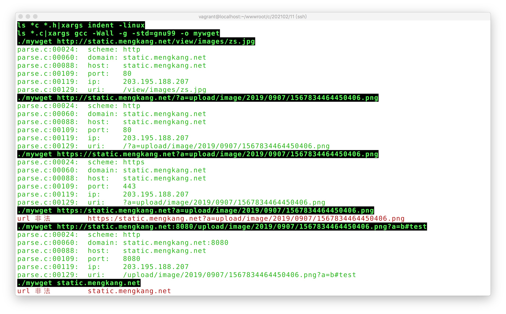

## 函数式宏定义
```c
#include <stdio.h>
#include <stdbool.h>

static bool mywget_is_debug = true;

#define debug_log(format, ...) \
	do { \
		if (mywget_is_debug) { \
			printf("\033[32m%s:%05d:\t" format "\033[0m", __FILE__, __LINE__, ##__VA_ARGS__); \
		} \
	} while (0);

#define info_log(format, ...) \
    do { \
        printf("\033[31m" format "\033[0m", ##__VA_ARGS__); \
    } while (0);

#define error_log(format, ...) \
    do { \
        printf("\033[31m" format "\033[0m", ##__VA_ARGS__); \
    } while (0);

int main()
{
	debug_log("%d\n", 1);
	info_log("%d\n", 1);
	error_log("%d\n", 1);

    return 0;
}
```
`bool` 类型的引入 `stdbool.h`

```c
#include <stdio.h>
#include "log.h"

static bool mywget_is_debug = false;

void set_debug(bool flag)
{
	mywget_is_debug = flag;
}

bool is_debug()
{
	return mywget_is_debug;
}
```

将`static bool mywget_is_debug`定义在`log.c`文件中，静态变量，同时只能该文件自己访问，作用域不会影响外部

## 项目优化

定义一个`log.h`，之前打印的地方改为`debug_log`和`error_log`，完整代码地址如下：

https://gitee.com/zhoumengkang/just-cc/blob/master/code/1101

