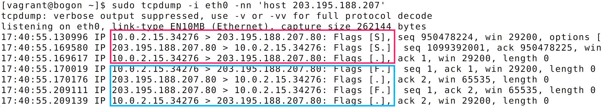
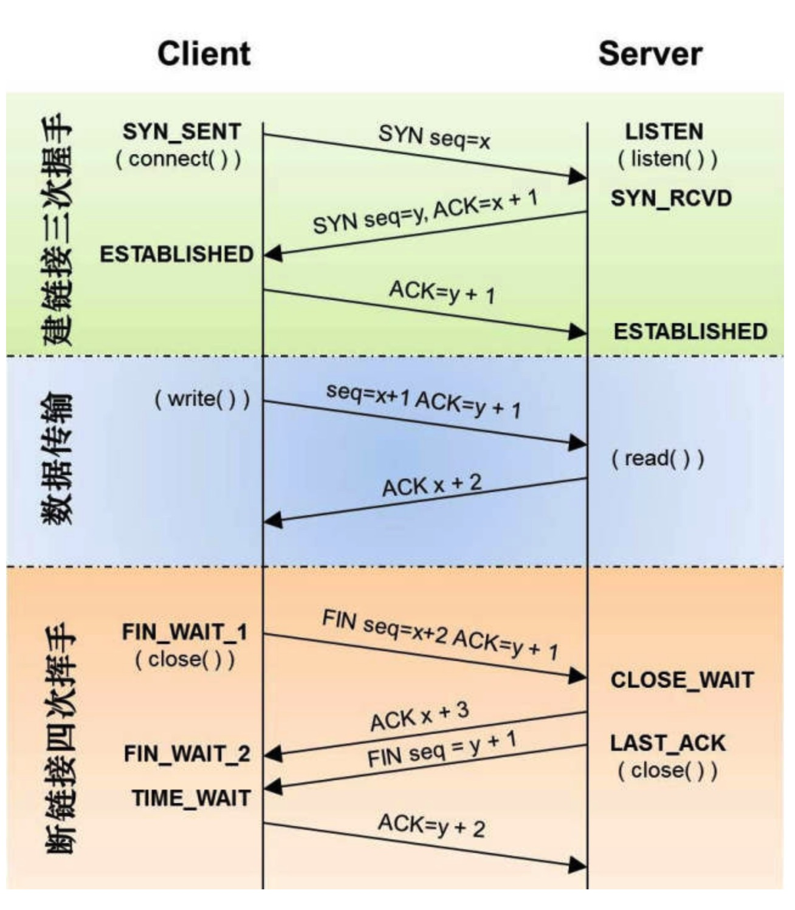
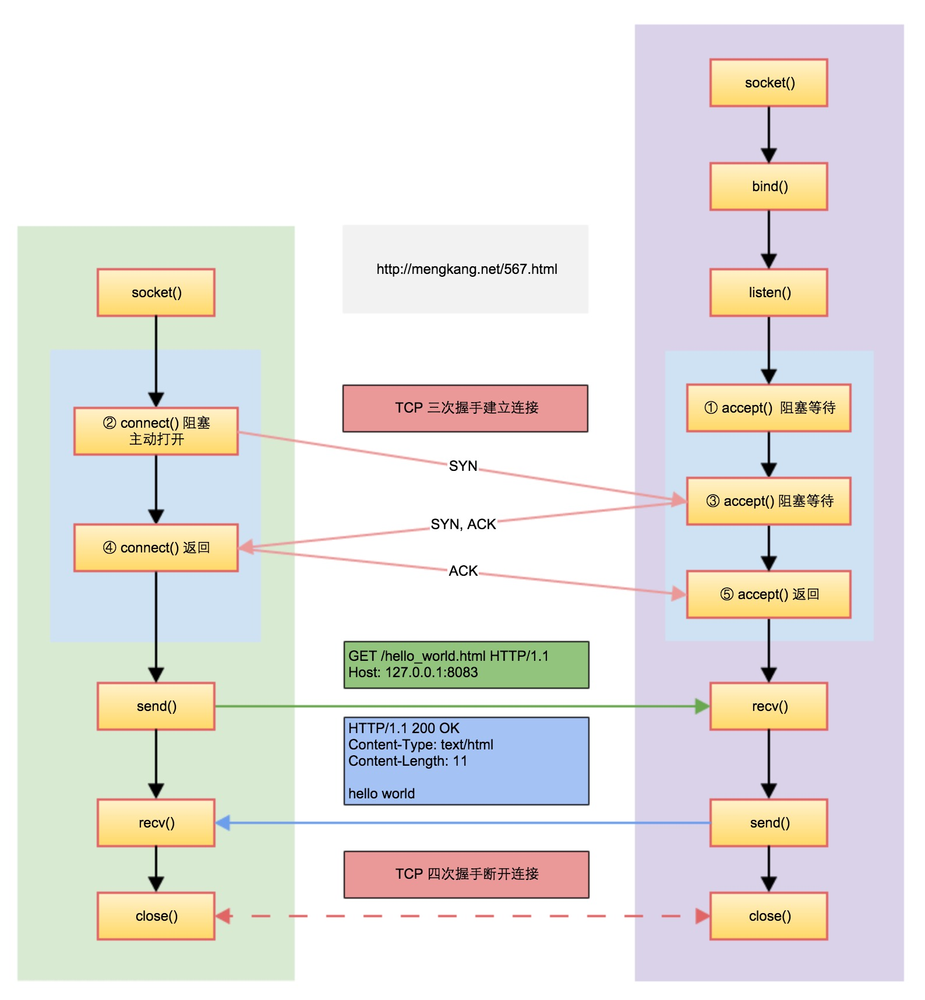

## 看得见的 TCP/IP
`TCP/IP` 网络连接需要三次握手，网络断开需要四次挥手，可以通过如下程序验证
```c
#include <stdio.h>
#include <string.h>
#include <stdlib.h>
#include <sys/socket.h>
#include <netinet/in.h>
#include <netinet/ip.h>		/* superset of previous */
#include <arpa/inet.h>
#include <unistd.h>
#include <netdb.h>

int main()
{
	int sockfd = socket(AF_INET, SOCK_STREAM, 0);

	struct sockaddr_in servaddr;
	servaddr.sin_family = AF_INET;
	servaddr.sin_port = htons(80);

	struct hostent *hostent = gethostbyname("static.mengkang.net");
	char *ip = inet_ntoa(*(struct in_addr *)hostent->h_addr_list[0]);

	inet_pton(AF_INET, ip, &servaddr.sin_addr);

	// 建立连接
	connect(sockfd, (struct sockaddr *)&servaddr, sizeof(servaddr));
	// 断开连接
	close(sockfd);

	return 0;
}
```
在编译运行之前，读者可以新开一个终端通过`tcpdump`监听与`static.mengkang.net`（其服务器 `ip` 为`203.195.188.207`）的网络传输
```bash
$ sudo tcpdump -i eth0 -nn 'host 203.195.188.207'
```
编译运行会得到如图所示数据



标志位 | 含义
----- | -----
Flags [S] | SYN
Flags [S.] | SYN + ACK
Flags [.] | ACK
Flags [F.] | FIN + ACK
Flags [.] | ACK
Flags [F.] | FIN + ACK
Flags [.] | ACK



## 增加网络数据传输

应用层`http`协议是建议在`tcp/ip`传输层协议之上的，我们要实现`http`的请求到响应，则必须基于`socket`函数族来实现`tcp/ip`的通讯连接，这是之前博客里面的总结的一张图。


因为要做的是下载工具，我们只谈 `socket` 客户端的逻辑。客户端的操作为5步：
- `socket()` 创建一个`socket`通讯
- `connect()`与服务端建立连接
- `send()`或者`write`发送请求，比如 `http` 请求信息
- `recv()`或者`read`接受请求，读取返回的信息
- `close()`关闭连接

```c
#include <stdio.h>
#include <string.h>
#include <stdlib.h>
#include <sys/socket.h>
#include <netinet/in.h>
#include <netinet/ip.h>		/* superset of previous */
#include <arpa/inet.h>
#include <unistd.h>
#include <netdb.h>

int main()
{
	// create
	int sockfd = 0;

	if ((sockfd = socket(AF_INET, SOCK_STREAM, 0)) < 0) {
		exit(1);
	}

	// connect
	struct sockaddr_in servaddr;
	servaddr.sin_family = AF_INET;
	servaddr.sin_port = htons(80);

	struct hostent *hostent = gethostbyname("static.mengkang.net");
	char *ip = inet_ntoa(*(struct in_addr *)hostent->h_addr_list[0]);

	if (inet_pton(AF_INET, ip, &servaddr.sin_addr) < 0) {
		exit(1);
	}

	if (connect(sockfd, (struct sockaddr *)&servaddr, sizeof(servaddr)) < 0) {
		exit(1);
	}

    // write
	const char *http_request_header =
	    "GET /view/images/zs.jpg HTTP/1.1\r\nHost: static.mengkang.net\r\nConnection: Close\r\n\r\n";

	if (write(sockfd, http_request_header, strlen(http_request_header)) < 0) {
		exit(1);
	}

    // read
	char response_buf[128] = { 0 };
	int len = 0;

	if ((len = read(sockfd, response_buf, 128)) > 0) {
		printf("%s", response_buf);
	}

    // close
	close(sockfd);
	return 0;
}
```
## 重点函数
#### socket
创建 `socket`描述符
```c
int socket(int domain, int type, int protocol);
```
#### inet_pton
`ip`地址转换函数，以便用于`connect`
```c
int inet_pton(int af, const char *src, void *dst);
```
#### connect
通过创建的`socket`的描述符，建立网络连接
```c
int connect(int sockfd, const struct sockaddr *addr, socklen_t addrlen);
```
#### write & read
对描述符进行 I/O 读写操作，传输数据
```c
ssize_t write(int fd, const void *buf, size_t count);
ssize_t read(int fd, void *buf, size_t count);
```
