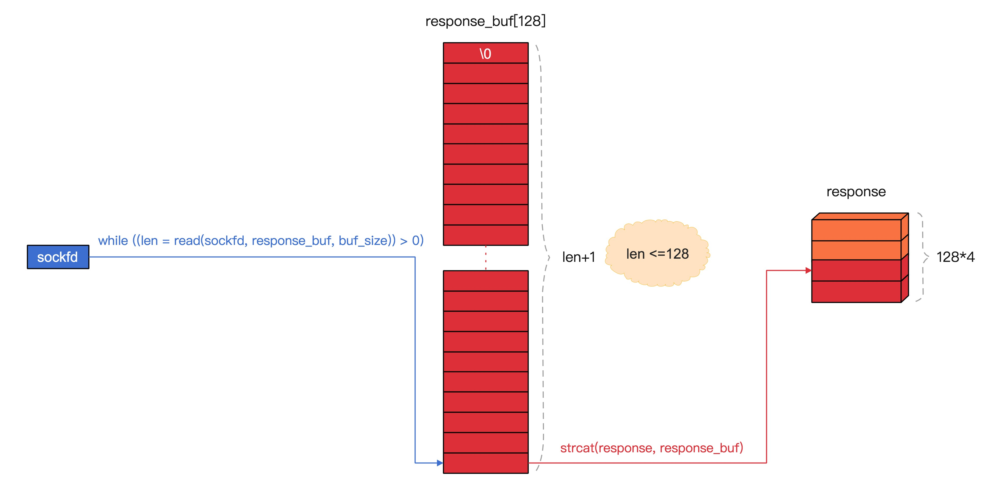

## 思路
这节中，我们将根据 `http` 协议对`http header` 进行解析，下节再进行文件的存储。

应用层`http`协议是建议在`tcp/ip`传输层协议之上的，很多二进制`rpc`协议在定义中，`header`是定长的(固定边界协议)，`header`再分几段，每段都是固定的长度，代表不同的含义，都有一个很重要的值，就是在header中指定了`body`的长度。这就是"协议"，定义好的内容，传输和解析都按定义好的"协议"来解析。

> https://mengkang.net/1221.html

`http`协议比较特殊，它是纯文本的，而且`header`是不定长的，通过`\r\n\r\n`来标识`header`的结束，因为纯文本的，`header`里面是不能存在`\0`的，这样会导致`http`解析失败，同时它的`header`里面也会标注`body`的长度。

> 记得之前在后端代码里标注了图片内容的长度，但是实际输出的时候因为`gzip`压缩，但是实际输出的长度小于`header`里声明的长度，导致浏览器一直转圈，浏览器则认为数据还没接受完毕。

```c
char *http_create_request(http_url * url);
int http_connect(http_url * url);
int http_download(int sockfd);
```

## 拼接请求
首先我们要拼接`HTTP/1.1`请求头
```bash
GET /view/images/zs.jpg HTTP/1.1
Host: static.mengkang.net
Connection: Close

```
最主要的这三行，每行用`\r\n`结尾，`http header`与`http body`中间在多一空行，所以最后是`\r\n\r\n`。

新建文件`wget.c`
```c
#include <stdio.h>
#include <string.h>
#include <stdlib.h>
#include <sys/socket.h>
#include <netinet/in.h>
#include <netinet/ip.h>		/* superset of previous */
#include <arpa/inet.h>
#include <unistd.h>
#include "log.h"
#include "parse.h"

char *http_create_request(http_url * url)
{
	const char *request_tpl = "GET %s HTTP/1.1\r\nHost: %s\r\nConnection: Close\r\n\r\n";

	int size = strlen(request_tpl) + strlen(url->uri) + strlen(url->host) - 4 + 1;

	char *http_request = (char *)malloc(size);

	sprintf(http_request, request_tpl, url->uri, url->host);

	debug_log("http_request\t%s\n", http_request);

	return http_request;
}
```

## 建立连接
```c
int http_connect(http_url * url)
{
	// create
	int sockfd = 0;

	if ((sockfd = socket(AF_INET, SOCK_STREAM, 0)) < 0) {
		exit(1);
	}
	
	// connect
	struct sockaddr_in servaddr;
	servaddr.sin_family = AF_INET;
	servaddr.sin_port = htons(url->port);

	if (inet_pton(AF_INET, url->ip, &servaddr.sin_addr) < 0) {
		exit(1);
	}

	if (connect(sockfd, (struct sockaddr *)&servaddr, sizeof(servaddr)) < 0) {
		exit(1);
	}
	
	// write
	char *http_request = http_create_request(url);

	if (write(sockfd, http_request, strlen(http_request)) < 0) {
		exit(1);
	}

	free(http_request);

	return sockfd;
}
```
## 响应解析
通过抓包发现 http://static.mengkang.net/view/images/zs.jpg 返回值如下
```bash
HTTP/1.1 200 OK
Server: nginx
Date: Wed, 03 Mar 2021 14:27:15 GMT
Content-Type: image/jpeg
Content-Length: 106667
Last-Modified: Sat, 16 Dec 2017 03:03:48 GMT
Connection: close
ETag: "5a348d14-1a0ab"
Expires: Fri, 02 Apr 2021 14:27:15 GMT
Cache-Control: max-age=2592000
Accept-Ranges: bytes

...http body
```
如果我们要解析 http 返回值，我们则先解析头，然后存储 body 体。代码如下，后面附带了具体的代码解读和分析
```c
int http_download(int sockfd)
{
	// read
	int buf_size = 128;
	int response_size = buf_size * 4;
	int len = 0;
	int header_length = 0;

	char response_buf[buf_size];
	memset(response_buf, 0, buf_size);

	char *response = (char *)malloc(response_size);
	memset(response, 0, response_size);

	while ((len = read(sockfd, response_buf, buf_size)) > 0) {

		if (header_length + len >= response_size) {
			response_size *= 2;
			char *response_new = (char *)realloc(response, response_size);

			if (!response_new) {
				error_log("realloc error\n");
				exit(1);
			}

			if (response_new != response) {
				free(response);
				response = response_new;
			}
		}

		response_buf[len] = '\0';
		strcat(response, response_buf);

		char *header_end = strstr(response, "\r\n\r\n");

		if (header_end) {
			int offset = header_end - response;
			response[offset] = '\0';
			printf("%s\n", response);
			break;
		}

		header_length += len;
	}
	
	free(response);

	// close
	close(sockfd);

	return 0;
}
```
1. 在`sockfd`通讯中数据是流式的，我们可以通过协商好的`rpc`协议得知读取到哪里是一次请求的结束，一般都是在`rpc`协议的`header`里会解析出`body`的长度。

2. 读取的方式是循环读取`sockfd`到本地的一个`char`数组（`response_buf`）中，`response_buf`也被成为缓冲区。

3. 在循环读取的过程中，将每次缓冲区`response_buf`中的数据，通过`strcat`追加到在`堆`上申请内存空间的`response`后面。

4. 在读取的过程中，累计记录读取的总长度，当长度超过现有`response`内存可以存储的空间长度时，则需要通过`realloc`对其`response`进行扩容之后再继续操作。

5. 每次追加`response_buf`到`response`，需要检测`response`中是否已经存在`\r\n\r\n`，因为这是`http`协议对`header`和`body`的分隔标识。

> 补上一张图便于大家理解



## 附录
#### strcat
```c
char *strcat(char *dest, const char *src);
```
把 src 所指向的字符串追加到 dest 所指向的字符串的结尾。

> 因为`response_buf`是读取的长度的`len`，数组下表从0开始，正好可以设置`response_buf[len] = '\0'`这样就确保字符串的安全

#### realloc
```c
void *realloc(void *ptr, size_t size);
```
尝试重新调整之前调用 `mallo`c 或 `calloc` 所分配的 `ptr` 所指向的内存块的大小。

#### 完整代码
https://gitee.com/zhoumengkang/just-cc/blob/master/code/1202