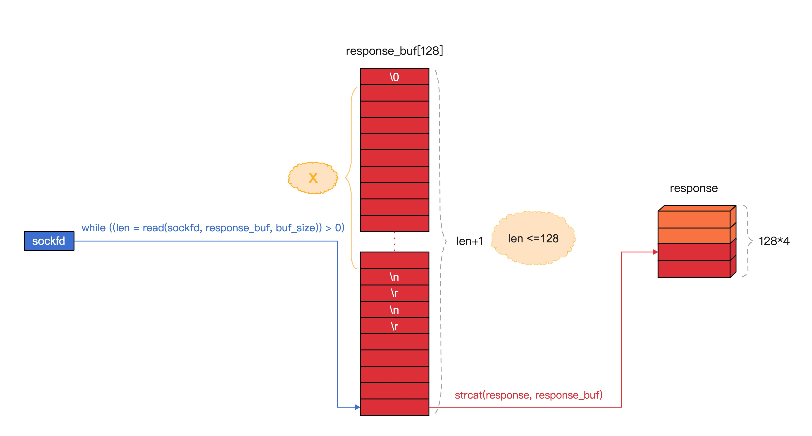
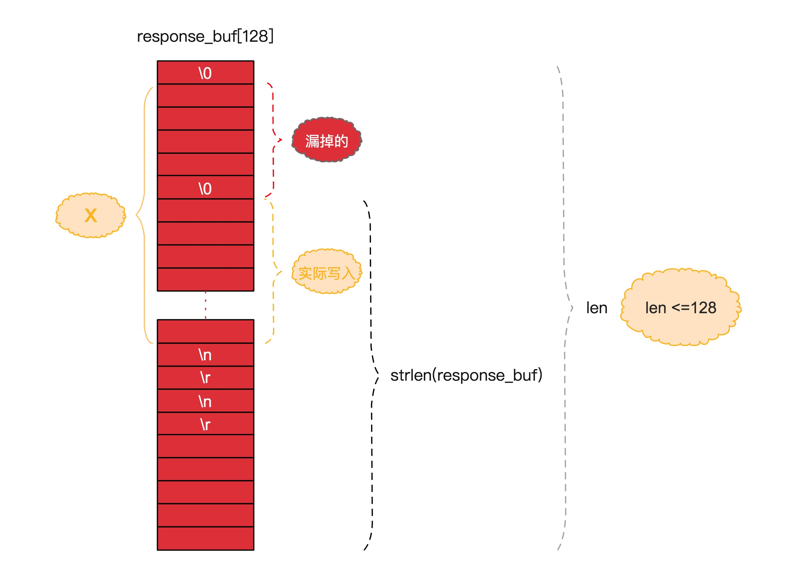

根据上节的思路，我们需要将`response_buf`在`\r\n\r\n`后面的部分写到需要存储的文件中，也是图示中的`x`区域


> 为了便于理解将`\r\n\r\n`写在了一起，有可能需要两次读取拼接起来，所以需要`strstr(response, "\r\n\r\n")` 而不能`strstr(response_buf, "\r\n\r\n")`

## 文件存储
```c
int http_download(int sockfd, const char *filename)
{
    // ... 省略
	int fd = open(filename, O_CREAT | O_WRONLY, 0777);
	
	while ((len = read(sockfd, response_buf, buf_size)) > 0) {
		if (is_header) {
			// ... 省略
			response_buf[len] = '\0';
			strcat(response, response_buf);

			char *header_end = strstr(response, "\r\n\r\n");

			if (header_end) {
				char *response_body = header_end + 4;
				write(fd, response_body, strlen(response_body));
			}
		} else {
			write(fd, response_buf, len);
		}
	}

	free(response);
	close(sockfd);

	return 0;
}
```
我们理解`header_end + 4`就是图示中的`x`区域，所以首先写入这部分数据，然后后面的循环的数据全部写入，则得到的完整的图片数据了。
实际测试图片下载的数据有缺失，为什么呢？

## 二进制安全

`http header`是纯文本，中间不能存在`\0`，但是`http body`是图片数据是二进制的，所以里面是可能存在`\0`，所以为什么`read`和`write`都是有第三个参数`size`。

> 很多地方在处理字符串二进制安全的时候，都会使用结构体封装原始的`char *`再配对一个`size`，项目中需要存储字符串则使用这个结构体。

如果在`response_buf`后半部分(`\r\n\r\n`之后)中有`\0`，那么`strcat(response, response_buf)`则拷贝的数据数据是不完整的，上面代码中实际写入的数据只有图示中的`实际写入`部分，缺失了`漏掉的`部分。



#### 代码优化

在原来代码的基础上继续写，会有很多层`if`嵌套，我们编写代码的时候应该尽量减少逻辑判断的嵌套。提取了`realloc`操作，最重要的：补充了丢失数据的读取。
```c
static char *realloc_response(char *response, int size)
{

	char *response_new = (char *)realloc(response, size);

	if (!response_new) {
		error_log("realloc error\n");
		exit(1);
	}

	if (response_new != response) {
		free(response);
		response = response_new;
	}

	return response;
}

int http_download(int sockfd, const char *filename)
{
	int buf_size = 128;
	int response_size = buf_size * 4;
	int len = 0;
	int header_length = 0;
	bool is_body = false;

	char response_buf[buf_size];
	memset(response_buf, 0, buf_size);

	char *response = (char *)malloc(response_size);
	memset(response, 0, response_size);

	int fd = open(filename, O_CREAT | O_WRONLY, 0777);

	while ((len = read(sockfd, response_buf, buf_size)) > 0) {
        
        // 如果是 body 体数据，则直接写入文件
		if (is_body) {
			write(fd, response_buf, len);
			continue;
		}
        
        // header 过长，response 内存不够则扩容
		if (header_length + len >= response_size) {
			response_size *= 2;
			response = realloc_response(response, response_size);
		}

		response_buf[len] = '\0';
		strcat(response, response_buf);

		char *header_end = strstr(response, "\r\n\r\n");

        // 没有匹配上，则直接进入下次网络数据读取
		if (!header_end) {
			continue;
		}
		
        // 如果匹配上，后续操作均为 body 体操作
		is_body = true;

		header_length = header_end - response;
		char *response_header = strndup(response, header_length);
		printf("%s\n", response_header);
		free(response_header);

        // 图示中 "实际写入部分"的数据写入
		char *response_body = response + header_length + 4;
		write(fd, response_body, strlen(response_body));

        // 如果通过字符串形式 strlen 统计 response_buf 长度
        // 如果小于实际从网络读取的长度，则把这部分数据补上，图示中"漏掉的"数据
		int response_buf_len = strlen(response_buf);
		if (response_buf_len < len) {
			char *padding = response_buf + response_buf_len;
			write(fd, padding, len - response_buf_len);
		}
	}

	free(response);

	close(sockfd);

	return 0;
}
```
#### GDB 调试
到目前为止，我们写的最复杂的函数就是`http_download`了，那么实际在编写的过程中，或多或少会出现写错的情况，实际项目开发过程中，我们免不了需要调试，下面就以`http_download`功能为例，进行实际的调试。

为此单独成篇，方便后面大家查阅 [使用 GDB 调试](#/20/02-gdb)

#### 编译运行
```bash
$ ./test
ls *c *.h|xargs indent -linux
ls *.c|xargs gcc -Wall -g -std=gnu99 -o mywget
./mywget http://static.mengkang.net/view/images/zs.jpg
parse.c:00024:	scheme:	http
parse.c:00060:	domain:	static.mengkang.net
parse.c:00088:	host:	static.mengkang.net
parse.c:00109:	port:	80
parse.c:00120:	ip:	203.195.188.207
parse.c:00130:	uri:	/view/images/zs.jpg
http.c:00028:	http_request	GET /view/images/zs.jpg HTTP/1.1
Host: static.mengkang.net
Connection: Close


HTTP/1.1 200 OK
Server: nginx
Date: Sat, 06 Mar 2021 14:36:59 GMT
Content-Type: image/jpeg
Content-Length: 106667
Last-Modified: Sat, 16 Dec 2017 03:03:48 GMT
Connection: close
ETag: "5a348d14-1a0ab"
Expires: Mon, 05 Apr 2021 14:36:59 GMT
Cache-Control: max-age=2592000
Accept-Ranges: bytes
```
#### 完整版
https://gitee.com/zhoumengkang/just-cc/blob/master/code/1203