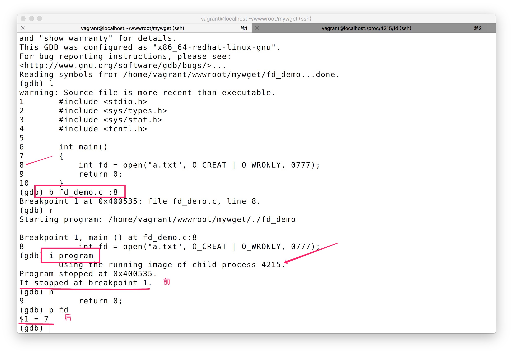
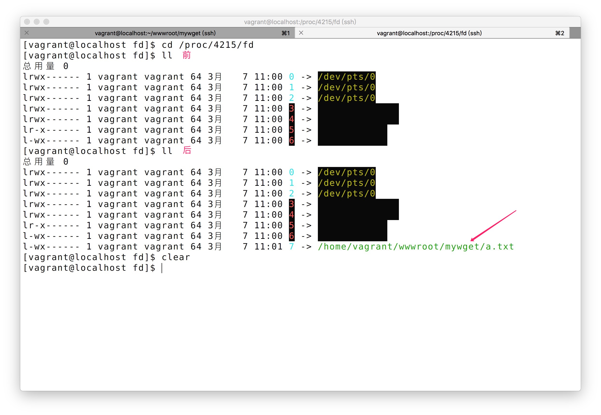

要做炫酷的进度条功能，我们还是需要重新梳理认识下 I/O。通过反复的使用，知识的细节也慢慢更加清晰。

前面我们在`socket`通讯中，做的是网络`I/O`，下载数据存储到本地文件，做的是文件`I/O`都使用了`write`方法

```c
ssize_t write(int fd, const void *buf, size_t count);
```
第一个参数是文件描述符，即在进程里打开文件的编号，通过这个编号就能找到该文件（包括前面的`socket`创建的描述符），然后做后续的操作。

每个进程都会默认打开3个文件描述符，即`0`、`1`、`2`。其中`0`代表标准输入、`1`代表标准输出、`2`代表标准错误。

## 认识文件描述符
为了更直观的了解文件描述符，可以通过实验一探究竟
```c
#include <stdio.h>
#include <sys/types.h>
#include <sys/stat.h>
#include <fcntl.h>

int main()
{
    int fd = open("a.txt", O_CREAT | O_WRONLY, 0777);
    return 0;
}
```
- `gdb`调试上面的程序
- `b fd_demo.c:8` 在打开文件处增加断点 
- `i program` 然后获得正在调试的进程 id 
- `cd /proc/4215/fd` 查看现有文件描述符列表，`3~6`是和`gdb`通讯用，正常不会有，可以后面不使用`gdb`,直接输`fd`的值来验证
- `n` + `p fd` 得到`7`
- 在查看`/proc/4215/fd`里的描述符列表，发现`7`指向的是我们编辑的文件



## 标准输入、标准输出和标准错误
我们在做定时任务的时候可能习惯于
```bash
* * * * * xxx >> a.log 2>&1
```
`2>&1`意思是把 标准错误输出重定向到标准输出，`>> a.log`等同于`1>> a.log`标准输出直接写到`a.log`

上例我们看到一个进程启动之后，标准三输的描述符都创建了，我们使用`printf`也是往标准输出里写入数据
```c
#include <stdio.h>
#include <unistd.h>

int main()
{
	printf("Hello world\n");
	write(1, "mywget\n", 7);
	return 0;
}
```
发现`write`写入到文件描述符`1`的数据也输出到了终端，因为终端是默认输出。
```bash
$ ./stdout_demo
Hello world
mywget
```
```bash
$ ./stdout_demo > a.txt && cat a.txt
mywget
Hello world
```
!> 为什么当我们指定标准输出的文件之后，`write`数据先写入，`printf`输出的数据后写入了呢？？

```c
#include <stdio.h>
#include <unistd.h>

int main()
{
	printf("Hello world\n");
	fflush(stdout);
	write(1, "mywget\n", 7);
	return 0;
}
```
```bash
$ ./stdout_demo > a.txt && cat a.txt
Hello world
mywget
```