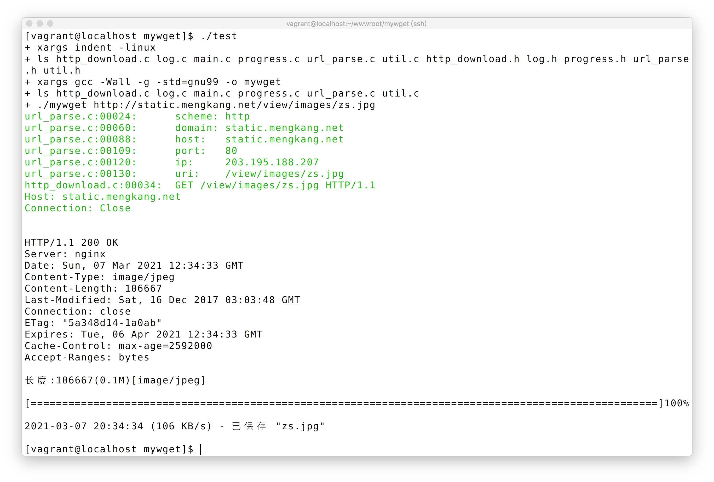

## 解析 Header 获取总长度
需要知道下载进度，前提需要已下载数据大小和总数据大小，所以还需要补充`http header`的解析，`header`中`Content-Length`对应`body`总长度。

首先定义`http_response_header`结构体
```c
typedef struct {
    unsigned int http_code;
    unsigned long content_length;
    char *content_type;
} http_response_header;
```

`http header`信息除了第一行之外，其他的均为 `K: v`的形式，每行用`\r\n`分隔，我们以该协议为基础进行解析

#### 使用 strtok 循环切割字符串
```c
#include <stdio.h>
#include <string.h>

int main()
{
	char str[255] ="HTTP/1.1 200 OK\r\nServer: nginx\r\nDate: Sun, 07 Mar 2021 08:51:41 GMT\r\nContent-Type: image/jpeg\r\nContent-Length: 106667";
	char *token;
	char *tmp = str;

	while ((token = strtok(tmp, "\r\n")) != NULL) {
		printf("%s\n", token);
		tmp = NULL;
	}
	return 0;
}
```
完整版代码
```c
http_response_header *http_response_header_prase(const char *str, int len)
{
	char *header_str = strndup(str, len);

	http_response_header *http_res =
	    (http_response_header *) malloc(sizeof(http_response_header));

	const char *len_end = "\r\n";
	int line = 0;
	char *tmp = header_str;
	char *current_line;

	while ((current_line = strtok(tmp, len_end)) != NULL) {
		debug_log("%s\n", current_line);
		tmp = NULL;
		line++;

		if (line == 1) {
			if (strcmp(current_line, "HTTP/1.1 200 OK") != 0) {
				error_log("http 状态码异常\n");
				exit(1);
			}

			http_res->http_code = 200;
			continue;
		}

		char *p = strchr(current_line, ':');

		if (!p)
			continue;

		if (strncmp
		    (current_line, "Content-Length", p - current_line) == 0) {
			http_res->content_length = atoi(p + 2);
		} else
		    if (strncmp
			(current_line, "Content-Type", p - current_line) == 0) {
			http_res->content_type = strdup(p + 2);
		}
	}

	free(header_str);
	printf("长度:%lu(%0.1fM)[%s]\n", http_res->content_length,
	       (float)http_res->content_length / (1024 * 1024),
	       http_res->content_type);

	return http_res;
}
```
## 下载进度函数
新建`progress.h`
```c
#ifndef MYWGET_PROGRESS_H
#define MYWGET_PROGRESS_H

#include <stdbool.h>

char *get_progress_format();
void download_progress(unsigned long download_size, unsigned long total_size);

#endif
```
具体实现`progress.c`
```c
#include <stdio.h>
#include <sys/ioctl.h>
#include <unistd.h>
#include <string.h>
#include <stdlib.h>
#include "progress.h"

static int cols;

char *get_progress_format()
{
	static char *progress_format = NULL;

	if (progress_format != NULL) {
		return progress_format;
	}

	progress_format = (char *)malloc(20);
	memset(progress_format, 0, 20);

	struct winsize size;
	ioctl(STDIN_FILENO, TIOCGWINSZ, &size);
	cols = size.ws_col;

	const char *progress = "[]100%";
	cols = cols - strlen(progress);

	char cols_str[10] = { 0 };
	sprintf(cols_str, "%d", cols);

	strcat(progress_format, "[%-");
	strcat(progress_format, cols_str);
	strcat(progress_format, "s]%d%%\r");

	return progress_format;
}

void download_progress(unsigned long download_size, unsigned long total_size)
{
	char *progress_format = get_progress_format();

	char progress_bar[cols + 1];
	memset(progress_bar, 0, cols + 1);

	long num = (download_size * cols) / total_size;

	for (long i = 1; i <= num; i++) {
		strcat(progress_bar, "=");
	}

	printf(progress_format, progress_bar,
	       (download_size * 100) / total_size);

	fflush(stdout);
}
```

#### 完整代码
然后在`http_download`函数中引入`http_response_header_prase`，`download_progress`和`download_end`，并且增加已下载长度统计。

增加了`download_end`函数
```c
void download_end()
{
    printf("\n");

    long times = get_time_ts() - download_start_ts;
    char *date_time = get_date_time();

    printf("%s (%ld KB/s) - 已保存 \"%s\"\n", date_time,
           download_size / (times * 1000), download_filename);

    char *progress_format = get_progress_format();
    free(progress_format);
    free(date_time);
}
```

https://gitee.com/zhoumengkang/just-cc/blob/master/code/1304

执行的最终效果图
