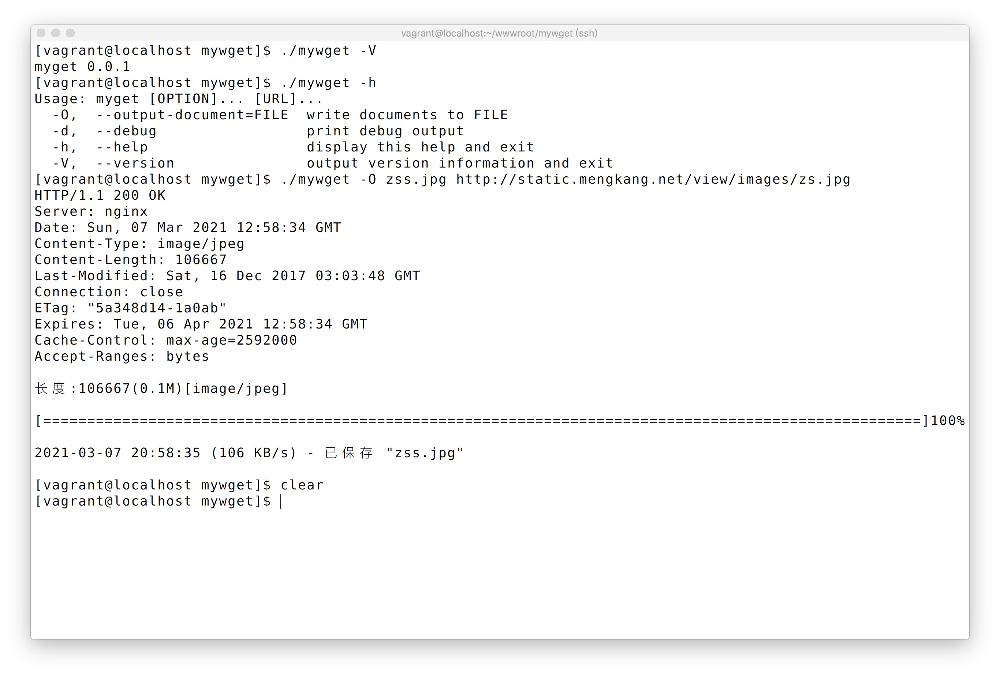

## wget_opt.h
```c
#ifndef MYWGET_WGET_OPT_H
#define MYWGET_WGET_OPT_H

#include <stdlib.h>
#include <getopt.h>

#define PROGRAM_NAME "myget"

static struct option const long_opts[] = {
        {"output-document", required_argument, NULL, 'O'},
        {"debug",           no_argument,       NULL, 'd'},
        {"version",         no_argument,       NULL, 'V'},
        {"help",            no_argument,       NULL, 'h'},
        {NULL,              0,                 NULL, 0}
};

void usage(int status);

#endif
```

## wget_opt.c
```c
#include <stdio.h>

#include "wget_opt.h"

void usage(int status)
{

    printf("Usage: %s [OPTION]... [URL]...\n", PROGRAM_NAME);

    if (status != 0) {
        fprintf(stderr, "Try '%s --help' for more information.\n", PROGRAM_NAME);
    } else {
        fprintf(stdout, "  -O,  --output-document=FILE  write documents to FILE\n");
        fprintf(stdout, "  -d,  --debug                 print debug output\n");
        fprintf(stdout, "  -h,  --help                  display this help and exit\n");
        fprintf(stdout, "  -V,  --version               output version information and exit\n");
    }

    exit(status);
}
```

## main 函数优化
```c
#include <stdio.h>
#include <string.h>
#include <stdlib.h>
#include "url_parse.h"
#include "log.h"
#include "http_download.h"
#include "wget_opt.h"

int main(int argc, char *const argv[])
{
	int optc;
	const char *filename = NULL;

	while ((optc = getopt_long(argc, argv, "O:dVh", long_opts, NULL)) != -1) {
		//    printf("optc:%c\toptarg:%s\toptind:%d\n", optc, optarg, optind);

		switch (optc) {
		case 'O':
			filename = optarg;
			break;
		case 'd':
			set_debug(true);
			break;
		case 'V':
			printf("%s 0.0.1\n", PROGRAM_NAME);
			exit(0);
		case 'h':
			usage(0);
			break;
		case '?':
			usage(1);
			break;
		}
	}

	if (optind + 1 != argc) {
		usage(1);
	}

	const char *url = argv[optind];

	char *scheme = parse_scheme(url);
	char *domain = parse_domain(url, scheme);
	char *host = parse_host(domain);
	int port = parse_port(domain, scheme);
	char *ip = parse_ip(host);
	char *uri = parse_uri(url, scheme, domain);

	http_url *wget_url = (http_url *) malloc(sizeof(http_url));

	wget_url->scheme = scheme;
	wget_url->domain = domain;
	wget_url->host = host;
	wget_url->port = port;
	wget_url->ip = ip;
	wget_url->uri = uri;

	int fd = http_connect(wget_url);
	http_download(fd, filename);

	free(scheme);
	free(domain);
	free(host);
	free(ip);
	free(uri);

	free(wget_url);

	return 0;
}
```
#### 完整代码

https://gitee.com/zhoumengkang/just-cc/blob/master/code/1304

执行的最终效果图
