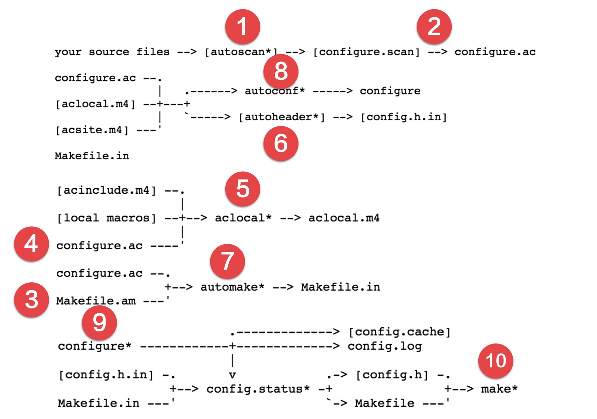

make 命令之所以能执行是因为在该目录中存在 Makefile 。Makefile 指导 make 命令的执行。当项目比较小，又不考虑跨平台，自己编写 Makefile 就行。

为了简化可移植构建的难度，autotools 应运而生，它是如何为可移植性服务的，后面的一步步操作中，大家就会慢慢体会到。它是GNU程序的标准构建系统，通过GNU autotools 生成 Makefile 官方有一篇介绍比较清晰 https://www.gnu.org/savannah-checkouts/gnu/autoconf/manual/autoconf-2.69/autoconf.html#Making-configure-Scripts

在上一节项目的基础上，创建一个`src`目录用于存放源代码
```bash
$ sudo make uninstall
$ make clean
$ rm -rf Makefile
$ mkdir src
$ mv * ./src
```
autotools 操作起来其实还是很复杂的，下面截图是我对官网手册的截图，附加了操作顺序的标识


## 执行 autoscan
首先通过`autoscan`自动扫描生成`configure.scan`，然后改名为`configure.ac`
```bash
$ autoscan
$ ls
autoscan.log  configure.scan  src
```
## 命名为 configure.ac
将 `configure.scan`重命名为`configure.ac`
```bash
$ mv configure.scan configure.ac
```
默认生成的`configure.ac`是 Autoconf 语言，用于对依赖文件、库进行检查。当后面执行`configure`命令时候就会看到的大量的`checking ...`

## 编写 Makefile.am

`Makefile.am`用于生成最后的`Makefile`，因为有子目录，我们需要编写两个`Makefile.am`，根目录下的`Makefile.am`输入如下内容
```bash
AUTOMAKE_OPTIONS = foreign
SUBDIRS = src
```
automake 提供了3种软件等级：foreign、gnu 和 gnits，供用户选择，默认等级为gnu。本例使需用foreign等级，它只检测必须的文件。
`src/Makefile.am`里输入
```bash
AM_CFLAGS = -Wall -std=gnu99 -g
bin_PROGRAMS = mywget
mywget_SOURCES = http_download.c  log.c  main.c  progress.c  url_parse.c  util.c  wget_opt.c
```
`AM_CFLAGS`指定编译时的参数，编译的目标文件名是`mywget`，`mywget_SOURCES`编译该二进制文件依赖的文件列表。

## 完善 configure.ac

```bash
#                                               -*- Autoconf -*-
# Process this file with autoconf to produce a configure script.

AC_PREREQ([2.69])
- AC_INIT([FULL-PACKAGE-NAME], [VERSION], [BUG-REPORT-ADDRESS])
+ AC_INIT([mywget], [0.0.1], [i@mengkang.net])
AC_CONFIG_SRCDIR([hello.c])
AC_CONFIG_HEADERS([config.h])
+ AM_INIT_AUTOMAKE
# Checks for programs.
AC_PROG_CC

# Checks for libraries.

# Checks for header files.

# Checks for typedefs, structures, and compiler characteristics.

# Checks for library functions.
+ AC_CONFIG_FILES([Makefile src/Makefile])
AC_OUTPUT
```
- 我们补充了软件的基本信息，软件包的名字，版本号，已经 bug 反馈邮箱
- 增加了`AM_INIT_AUTOMAKE`宏
- 增加了`AC_CONFIG_FILES([Makefile src/Makefile])` 用于生成两个 Makefile

## 执行 aclocal
使用 automake 时，`configure.ac`里的用的一些宏需要用 aclocal 工具产生，比如`AM_INIT_AUTOMAKE`。
`aclocal`根据`configure.ac`生成`aclocal.m4`。`autoconf` 在遇到不认识的宏时，就会从`aclocal.m4`中查找。
```bash
$ aclocal
$ ls
aclocal.m4  autom4te.cache  autoscan.log  configure.ac  Makefile.am  src
```
## 执行 autoheader
使用`autoheader`根据`configure.ac`和`aclocal.m4`生成`config.h.in`。（最终用于生成`config.h`，用于跨平台移植编译使用)
```bash
$ autoheader
$ ls
aclocal.m4  autom4te.cache  autoscan.log  config.h.in  configure.ac  Makefile.am  src
```
## 执行 automake
使用`automake`根据`Makefile.am`生成`Makefile.in`。
```bash
$ automake --add-missing
$ ls
aclocal.m4      autoscan.log  configure.ac  install-sh   Makefile.in  src
autom4te.cache  config.h.in   depcomp       Makefile.am  missing
```
## 执行 autoconf
使用`autoconf`将`configure.ac`生成`configure`，其中会用到`aclocal.m4`中定义的宏。
```bash
$ autoconf
$ ls
aclocal.m4      autoscan.log  configure     depcomp     Makefile.am  missing
autom4te.cache  config.h.in   configure.ac  install-sh  Makefile.in  src
```
## 执行 configure
执行`configure`命令，生成`Makefile`和`config.h`
```bash
$ ./configure
checking for a BSD-compatible install... /usr/bin/install -c
checking whether build environment is sane... yes
checking for a thread-safe mkdir -p... /usr/bin/mkdir -p
checking for gawk... gawk
checking whether make sets $(MAKE)... yes
checking whether make supports nested variables... yes
checking for gcc... gcc
checking whether the C compiler works... yes
checking for C compiler default output file name... a.out
checking for suffix of executables...
checking whether we are cross compiling... no
checking for suffix of object files... o
checking whether we are using the GNU C compiler... yes
checking whether gcc accepts -g... yes
checking for gcc option to accept ISO C89... none needed
checking for style of include used by make... GNU
checking dependency style of gcc... gcc3
checking how to run the C preprocessor... gcc -E
checking for grep that handles long lines and -e... /usr/bin/grep
checking for egrep... /usr/bin/grep -E
checking for ANSI C header files... yes
checking for sys/types.h... yes
checking for sys/stat.h... yes
checking for stdlib.h... yes
checking for string.h... yes
checking for memory.h... yes
checking for strings.h... yes
checking for inttypes.h... yes
checking for stdint.h... yes
checking for unistd.h... yes
checking arpa/inet.h usability... yes
checking arpa/inet.h presence... yes
checking for arpa/inet.h... yes
checking fcntl.h usability... yes
checking fcntl.h presence... yes
checking for fcntl.h... yes
checking netdb.h usability... yes
checking netdb.h presence... yes
checking for netdb.h... yes
checking netinet/in.h usability... yes
checking netinet/in.h presence... yes
checking for netinet/in.h... yes
checking for stdlib.h... (cached) yes
checking for string.h... (cached) yes
checking sys/ioctl.h usability... yes
checking sys/ioctl.h presence... yes
checking for sys/ioctl.h... yes
checking sys/socket.h usability... yes
checking sys/socket.h presence... yes
checking for sys/socket.h... yes
checking for unistd.h... (cached) yes
checking for stdbool.h that conforms to C99... yes
checking for _Bool... yes
checking for stdlib.h... (cached) yes
checking for GNU libc compatible malloc... yes
checking for stdlib.h... (cached) yes
checking for GNU libc compatible realloc... yes
checking for gethostbyname... yes
checking for inet_ntoa... yes
checking for memset... yes
checking for socket... yes
checking for strchr... yes
checking for strdup... yes
checking for strndup... yes
checking for strstr... yes
checking that generated files are newer than configure... done
configure: creating ./config.status
config.status: creating Makefile
config.status: creating src/Makefile
config.status: creating config.h
config.status: executing depfiles commands
```
## 测试
### 编译
有了`Makefile`我们就可以编译安装了，但是程序并没有用到`config.h`，后面我们再说其作用
```bash
$ make
make  all-recursive
make[1]: 进入目录“/home/vagrant/wwwroot/mywget”
Making all in src
make[2]: 进入目录“/home/vagrant/wwwroot/mywget/src”
gcc -DHAVE_CONFIG_H -I. -I..    -Wall -std=gnu99 -g -g -O2 -MT http_download.o -MD -MP -MF .deps/http_download.Tpo -c -o http_download.o http_download.c
mv -f .deps/http_download.Tpo .deps/http_download.Po
gcc -DHAVE_CONFIG_H -I. -I..    -Wall -std=gnu99 -g -g -O2 -MT log.o -MD -MP -MF .deps/log.Tpo -c -o log.o log.c
mv -f .deps/log.Tpo .deps/log.Po
gcc -DHAVE_CONFIG_H -I. -I..    -Wall -std=gnu99 -g -g -O2 -MT main.o -MD -MP -MF .deps/main.Tpo -c -o main.o main.c
mv -f .deps/main.Tpo .deps/main.Po
gcc -DHAVE_CONFIG_H -I. -I..    -Wall -std=gnu99 -g -g -O2 -MT progress.o -MD -MP -MF .deps/progress.Tpo -c -o progress.o progress.c
mv -f .deps/progress.Tpo .deps/progress.Po
gcc -DHAVE_CONFIG_H -I. -I..    -Wall -std=gnu99 -g -g -O2 -MT url_parse.o -MD -MP -MF .deps/url_parse.Tpo -c -o url_parse.o url_parse.c
mv -f .deps/url_parse.Tpo .deps/url_parse.Po
gcc -DHAVE_CONFIG_H -I. -I..    -Wall -std=gnu99 -g -g -O2 -MT util.o -MD -MP -MF .deps/util.Tpo -c -o util.o util.c
mv -f .deps/util.Tpo .deps/util.Po
gcc -DHAVE_CONFIG_H -I. -I..    -Wall -std=gnu99 -g -g -O2 -MT wget_opt.o -MD -MP -MF .deps/wget_opt.Tpo -c -o wget_opt.o wget_opt.c
mv -f .deps/wget_opt.Tpo .deps/wget_opt.Po
gcc -Wall -std=gnu99 -g -g -O2   -o mywget http_download.o log.o main.o progress.o url_parse.o util.o wget_opt.o
make[2]: 离开目录“/home/vagrant/wwwroot/mywget/src”
make[2]: 进入目录“/home/vagrant/wwwroot/mywget”
make[2]: 对“all-am”无需做任何事。
make[2]: 离开目录“/home/vagrant/wwwroot/mywget”
make[1]: 离开目录“/home/vagrant/wwwroot/mywget”
```
### 安装
```bash
$ mywget -V
-bash: /usr/local/bin/mywget: 没有那个文件或目录
$ sudo make install
Making install in src
make[1]: 进入目录“/home/vagrant/wwwroot/mywget/src”
make[2]: 进入目录“/home/vagrant/wwwroot/mywget/src”
 /usr/bin/mkdir -p '/usr/local/bin'
  /usr/bin/install -c mywget '/usr/local/bin'
make[2]: 对“install-data-am”无需做任何事。
make[2]: 离开目录“/home/vagrant/wwwroot/mywget/src”
make[1]: 离开目录“/home/vagrant/wwwroot/mywget/src”
make[1]: 进入目录“/home/vagrant/wwwroot/mywget”
make[2]: 进入目录“/home/vagrant/wwwroot/mywget”
make[2]: 对“install-exec-am”无需做任何事。
make[2]: 对“install-data-am”无需做任何事。
make[2]: 离开目录“/home/vagrant/wwwroot/mywget”
make[1]: 离开目录“/home/vagrant/wwwroot/mywget”
$ mywget -V
myget 0.0.1
```
### 运行
```bash
$ mywget -O zss.jpg http://static.mengkang.net/view/images/zs.jpg
HTTP/1.1 200 OK
Server: nginx
Date: Sun, 07 Mar 2021 14:43:03 GMT
Content-Type: image/jpeg
Content-Length: 106667
Last-Modified: Sat, 16 Dec 2017 03:03:48 GMT
Connection: close
ETag: "5a348d14-1a0ab"
Expires: Tue, 06 Apr 2021 14:43:03 GMT
Cache-Control: max-age=2592000
Accept-Ranges: bytes

长度:106667(0.1M)[image/jpeg]

[==================================================================================]100%

2021-03-07 22:43:04 (106 KB/s) - 已保存 "zss.jpg"

```
### 卸载
```bash
$ make clean
Making clean in src
make[1]: 进入目录“/home/vagrant/wwwroot/mywget/src”
test -z "mywget" || rm -f mywget
rm -f *.o
make[1]: 离开目录“/home/vagrant/wwwroot/mywget/src”
make[1]: 进入目录“/home/vagrant/wwwroot/mywget”
make[1]: 对“clean-am”无需做任何事。
make[1]: 离开目录“/home/vagrant/wwwroot/mywget”
$ sudo make uninstall
 ( cd '/usr/local/bin' && rm -f mywget )
```
这样就完全实现一个符合 GUN 规范的软件包，建议大家实际操作练习一遍。
```bash
$ rm *.log
$ rm -rf *.cache
$ tree .
.
├── aclocal.m4
├── config.h
├── config.h.in
├── config.status
├── configure
├── configure.ac
├── depcomp -> /usr/share/automake-1.13/depcomp
├── install-sh -> /usr/share/automake-1.13/install-sh
├── Makefile
├── Makefile.am
├── Makefile.in
├── missing -> /usr/share/automake-1.13/missing
├── src
│   ├── http_download.c
│   ├── http_download.h
│   ├── log.c
│   ├── log.h
│   ├── main.c
│   ├── Makefile
│   ├── Makefile.am
│   ├── Makefile.in
│   ├── progress.c
│   ├── progress.h
│   ├── test
│   ├── url_parse.c
│   ├── url_parse.h
│   ├── util.c
│   ├── util.h
│   ├── wget_opt.c
│   └── wget_opt.h
└── stamp-h1
```
同时将`depcomp`,`install-sh`,`missing`删除，复制原始文件到该目录下

#### 最终代码

https://gitee.com/zhoumengkang/just-cc/blob/master/code/1803