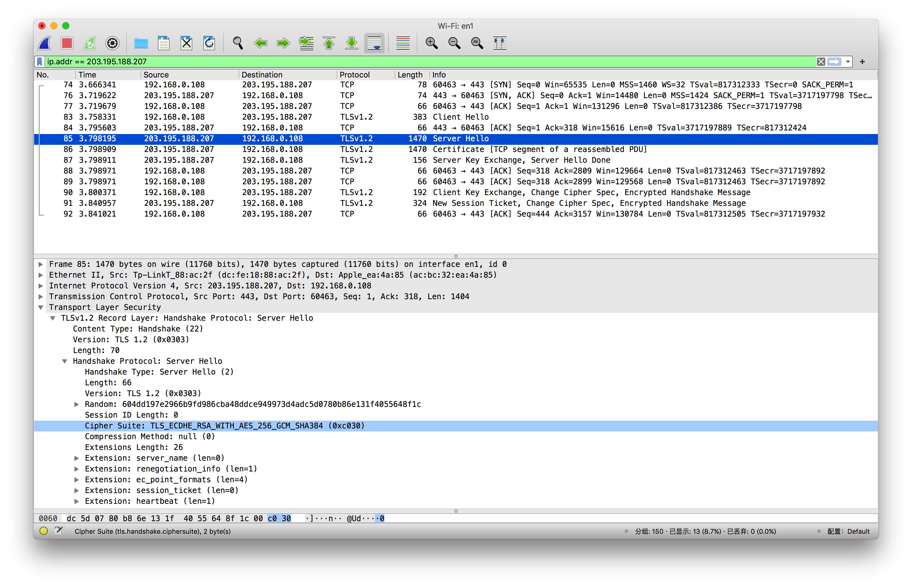

HTTP协议通信使用明文（不加密），从客户端往服务端发送请求时，内容可以被中间网络监听，导致数据泄露，比如账号密码被盗。当客户端从服务端读取数据时，中间商又可以篡改服务端返回的数据，比如强制添加广告，更可恶者直接返回钓鱼网站。 HTTPS是在HTTP上建立SSL加密层，并对传输数据进行加密，是HTTP协议的安全版。

`https`相关原理性的文章很多，本篇补充介绍实操验证。

## 申请证书
- 以 https://justcc.mengkang.net 为例，我作为该网站的服务端开发者，我先从第三方认证机构（`Let's Encrypt`）申请了证书；
- `Let's Encrypt`通过DNS解析确认我对`justcc.mengkang.net`域名的所有权等;
- 信息审核通过之后，`Let's Encrypt`会向我签发认证文件-证书。


**证书包含以下信息**
- https://justcc.mengkang.net 的公钥、组织信息和个人信息、签发机构 CA的信息、有效时间、证书序列号等信息 `justcc.mengkang.net.cer`
- `Let's Encrypt` 的公钥 `ca.cer` (`justcc.mengkang.net.cer`+`ca.cer` 连接在一起组成了下面`nginx`配置中的 `/data/www/justcc/cert.pem` 证书链)
- 同时包含一个签名（也就是下面`nginx`配置中的`/data/www/justcc/key.pem`）


证书链是一个信任链，`justcc.mengkang.net`信任`Let's Encrypt`，但是`Let's Encrypt`是 CA 机构中的新起之秀，还不够资深，大部分浏览器不相信，所以需要其依赖`DST Root CA X3` 根证书（IdenTrust CA 机构的根证书）

```bash
$ cat /data/www/justcc/cert.pem
-----BEGIN CERTIFICATE-----
MIIFLTCCBBWgAwIBAgISBEUto78ei4LlN46uYWVfe+z+MA0GCSqGSIb3DQEBCwUA
MDIxCzAJBgNVBAYTAlVTMRYwFAYDVQQKEw1MZXQncyBFbmNyeXB0MQswCQYDVQQD
EwJSMzAeFw0yMTAzMDgwMTI2NTRaFw0yMTA2MDYwMTI2NTRaMB4xHDAaBgNVBAMT
E2p1c3RjYy5tZW5na2FuZy5uZXQwggEiMA0GCSqGSIb3DQEBAQUAA4IBDwAwggEK
AoIBAQCSuSTDWNXfdHPX+AcTc3a3F2qSUGvtDxjZsKSt5ogbq8NG0/fninpkIc1c
Ufw2ptUh6M+Eq7lfoGVEuRmBdL/uMoEzpVlXZl1Vda1xkkA3ydN9srpbuOvIGMZL
CyRANeoJdTm/oixeTRH7NxUHx2be00rtLWR1RLiiA987vDd3nj+KLDf3WTJ3d9H/
hbjvUSp1jrIdR9c+OCKRuSEgMCbRpu3pA0umf5CfK2lgOOK7/AzNLplXoUmS+sTp
NRIPaJZzd1cafdayeNzHWHDwLu2X7E+ye1R9+idDDgxwfGDM80AzCksM9TX5c+Bs
lRVDKOS3uRQ1w1LOd0pbHxkmJQoDAgMBAAGjggJPMIICSzAOBgNVHQ8BAf8EBAMC
BaAwHQYDVR0lBBYwFAYIKwYBBQUHAwEGCCsGAQUFBwMCMAwGA1UdEwEB/wQCMAAw
HQYDVR0OBBYEFGz0qLfIQid3LsuHr7IJv/W4dJwFMB8GA1UdIwQYMBaAFBQusxe3
WFbLrlAJQOYfr52LFMLGMFUGCCsGAQUFBwEBBEkwRzAhBggrBgEFBQcwAYYVaHR0
cDovL3IzLm8ubGVuY3Iub3JnMCIGCCsGAQUFBzAChhZodHRwOi8vcjMuaS5sZW5j
ci5vcmcvMB4GA1UdEQQXMBWCE2p1c3RjYy5tZW5na2FuZy5uZXQwTAYDVR0gBEUw
QzAIBgZngQwBAgEwNwYLKwYBBAGC3xMBAQEwKDAmBggrBgEFBQcCARYaaHR0cDov
L2Nwcy5sZXRzZW5jcnlwdC5vcmcwggEFBgorBgEEAdZ5AgQCBIH2BIHzAPEAdgBE
lGUusO7Or8RAB9io/ijA2uaCvtjLMbU/0zOWtbaBqAAAAXgPqKiJAAAEAwBHMEUC
IQDlaeEYGZjAgY3i3w/EUE6JFAcXQ49Dxi/egGQE8zsRNwIgNhahsq+3lL/026ua
PqwlJYXl8U96lCOITzpWp0zt+G0AdwB9PvL4j/+IVWgkwsDKnlKJeSvFDngJfy5q
l2iZfiLw1wAAAXgPqKinAAAEAwBIMEYCIQDSTmNJ8kqe80gEgFBbgpZzFwHeMHbn
bnC0WLOEDf+dHQIhAPPk2sVLeIbrWl7c7wj5U77qSvCnKHLBRzgbPAp1JK1FMA0G
CSqGSIb3DQEBCwUAA4IBAQAqNoYUCoeKhz7qxMxPZmEiPo+4DZAouaY0JJdz6dUC
2aF+IW9NS+NRiTqsukV3BrORpFzpvk9ebiDMTohG9j6s1Q1R2B5uQzUGe2uXz6eC
WSlUYF2mDYJv9hEMKkBvr97v1TtljzKrwYPQ11GG//1cBs2FJOBSxlSCqaqk5IT6
KVEWUeq7i63ztEb/CAzVjFZ/qWte3Amch1ZRKkrncUInA+zJ3u+grKSgqTSWILZF
Aej8GOzJZP1CD/i5z/w0GunFpnnjXQI8/UUHajJUMHSFadczBHMeBV8dqksPhQ9E
elf8fzqJ624vWwR8H5oqJel3Zjo45JD2Itvt+DZAEoWp
-----END CERTIFICATE-----

-----BEGIN CERTIFICATE-----
MIIEZTCCA02gAwIBAgIQQAF1BIMUpMghjISpDBbN3zANBgkqhkiG9w0BAQsFADA/
MSQwIgYDVQQKExtEaWdpdGFsIFNpZ25hdHVyZSBUcnVzdCBDby4xFzAVBgNVBAMT
DkRTVCBSb290IENBIFgzMB4XDTIwMTAwNzE5MjE0MFoXDTIxMDkyOTE5MjE0MFow
MjELMAkGA1UEBhMCVVMxFjAUBgNVBAoTDUxldCdzIEVuY3J5cHQxCzAJBgNVBAMT
AlIzMIIBIjANBgkqhkiG9w0BAQEFAAOCAQ8AMIIBCgKCAQEAuwIVKMz2oJTTDxLs
jVWSw/iC8ZmmekKIp10mqrUrucVMsa+Oa/l1yKPXD0eUFFU1V4yeqKI5GfWCPEKp
Tm71O8Mu243AsFzzWTjn7c9p8FoLG77AlCQlh/o3cbMT5xys4Zvv2+Q7RVJFlqnB
U840yFLuta7tj95gcOKlVKu2bQ6XpUA0ayvTvGbrZjR8+muLj1cpmfgwF126cm/7
gcWt0oZYPRfH5wm78Sv3htzB2nFd1EbjzK0lwYi8YGd1ZrPxGPeiXOZT/zqItkel
/xMY6pgJdz+dU/nPAeX1pnAXFK9jpP+Zs5Od3FOnBv5IhR2haa4ldbsTzFID9e1R
oYvbFQIDAQABo4IBaDCCAWQwEgYDVR0TAQH/BAgwBgEB/wIBADAOBgNVHQ8BAf8E
BAMCAYYwSwYIKwYBBQUHAQEEPzA9MDsGCCsGAQUFBzAChi9odHRwOi8vYXBwcy5p
ZGVudHJ1c3QuY29tL3Jvb3RzL2RzdHJvb3RjYXgzLnA3YzAfBgNVHSMEGDAWgBTE
p7Gkeyxx+tvhS5B1/8QVYIWJEDBUBgNVHSAETTBLMAgGBmeBDAECATA/BgsrBgEE
AYLfEwEBATAwMC4GCCsGAQUFBwIBFiJodHRwOi8vY3BzLnJvb3QteDEubGV0c2Vu
Y3J5cHQub3JnMDwGA1UdHwQ1MDMwMaAvoC2GK2h0dHA6Ly9jcmwuaWRlbnRydXN0
LmNvbS9EU1RST09UQ0FYM0NSTC5jcmwwHQYDVR0OBBYEFBQusxe3WFbLrlAJQOYf
r52LFMLGMB0GA1UdJQQWMBQGCCsGAQUFBwMBBggrBgEFBQcDAjANBgkqhkiG9w0B
AQsFAAOCAQEA2UzgyfWEiDcx27sT4rP8i2tiEmxYt0l+PAK3qB8oYevO4C5z70kH
ejWEHx2taPDY/laBL21/WKZuNTYQHHPD5b1tXgHXbnL7KqC401dk5VvCadTQsvd8
S8MXjohyc9z9/G2948kLjmE6Flh9dDYrVYA9x2O+hEPGOaEOa1eePynBgPayvUfL
qjBstzLhWVQLGAkXXmNs+5ZnPBxzDJOLxhF2JIbeQAcH5H0tZrUlo5ZYyOqA7s9p
O5b85o3AM/OJ+CktFBQtfvBhcJVd9wvlwPsk+uyOy2HI7mNxKKgsBTt375teA2Tw
UdHkhVNcsAKX1H7GNNLOEADksd86wuoXvg==
-----END CERTIFICATE-----
```
前面部分为`justcc.mengkang.net.cer`公钥，后面部分为`ca.cer`是`Let's Encrypt`公钥。

## 部署证书

将证书和签名部署在`nginx`服务器上。

```bash
server {
        listen       443 ssl;

        ssl on;
        ssl_certificate      /data/www/justcc/cert.pem;
        ssl_certificate_key  /data/www/justcc/key.pem;

        server_name justcc.mengkang.net;
        index index.html;
        root  /data/www/justcc/just-cc/docs;
}
``` 

## 证书校验

通过`openssl`工具，可以查看到连接证书验证的全过程

> 参考 https://www.feistyduck.com/library/openssl-cookbook/online/ch-openssl.html

```bash
$ openssl s_client -crlf -connect justcc.mengkang.net:443 -servername justcc.mengkang.net
CONNECTED(00000003)
depth=2 O = Digital Signature Trust Co., CN = DST Root CA X3
verify return:1
depth=1 C = US, O = Let's Encrypt, CN = R3
verify return:1
depth=0 CN = justcc.mengkang.net
verify return:1
---
Certificate chain
 0 s:/CN=justcc.mengkang.net
   i:/C=US/O=Let's Encrypt/CN=R3
 1 s:/C=US/O=Let's Encrypt/CN=R3
   i:/O=Digital Signature Trust Co./CN=DST Root CA X3
---
Server certificate
-----BEGIN CERTIFICATE-----
MIIFLTCCBBWgAwIBAgISBEUto78ei4LlN46uYWVfe+z+MA0GCSqGSIb3DQEBCwUA
MDIxCzAJBgNVBAYTAlVTMRYwFAYDVQQKEw1MZXQncyBFbmNyeXB0MQswCQYDVQQD
EwJSMzAeFw0yMTAzMDgwMTI2NTRaFw0yMTA2MDYwMTI2NTRaMB4xHDAaBgNVBAMT
E2p1c3RjYy5tZW5na2FuZy5uZXQwggEiMA0GCSqGSIb3DQEBAQUAA4IBDwAwggEK
AoIBAQCSuSTDWNXfdHPX+AcTc3a3F2qSUGvtDxjZsKSt5ogbq8NG0/fninpkIc1c
Ufw2ptUh6M+Eq7lfoGVEuRmBdL/uMoEzpVlXZl1Vda1xkkA3ydN9srpbuOvIGMZL
CyRANeoJdTm/oixeTRH7NxUHx2be00rtLWR1RLiiA987vDd3nj+KLDf3WTJ3d9H/
hbjvUSp1jrIdR9c+OCKRuSEgMCbRpu3pA0umf5CfK2lgOOK7/AzNLplXoUmS+sTp
NRIPaJZzd1cafdayeNzHWHDwLu2X7E+ye1R9+idDDgxwfGDM80AzCksM9TX5c+Bs
lRVDKOS3uRQ1w1LOd0pbHxkmJQoDAgMBAAGjggJPMIICSzAOBgNVHQ8BAf8EBAMC
BaAwHQYDVR0lBBYwFAYIKwYBBQUHAwEGCCsGAQUFBwMCMAwGA1UdEwEB/wQCMAAw
HQYDVR0OBBYEFGz0qLfIQid3LsuHr7IJv/W4dJwFMB8GA1UdIwQYMBaAFBQusxe3
WFbLrlAJQOYfr52LFMLGMFUGCCsGAQUFBwEBBEkwRzAhBggrBgEFBQcwAYYVaHR0
cDovL3IzLm8ubGVuY3Iub3JnMCIGCCsGAQUFBzAChhZodHRwOi8vcjMuaS5sZW5j
ci5vcmcvMB4GA1UdEQQXMBWCE2p1c3RjYy5tZW5na2FuZy5uZXQwTAYDVR0gBEUw
QzAIBgZngQwBAgEwNwYLKwYBBAGC3xMBAQEwKDAmBggrBgEFBQcCARYaaHR0cDov
L2Nwcy5sZXRzZW5jcnlwdC5vcmcwggEFBgorBgEEAdZ5AgQCBIH2BIHzAPEAdgBE
lGUusO7Or8RAB9io/ijA2uaCvtjLMbU/0zOWtbaBqAAAAXgPqKiJAAAEAwBHMEUC
IQDlaeEYGZjAgY3i3w/EUE6JFAcXQ49Dxi/egGQE8zsRNwIgNhahsq+3lL/026ua
PqwlJYXl8U96lCOITzpWp0zt+G0AdwB9PvL4j/+IVWgkwsDKnlKJeSvFDngJfy5q
l2iZfiLw1wAAAXgPqKinAAAEAwBIMEYCIQDSTmNJ8kqe80gEgFBbgpZzFwHeMHbn
bnC0WLOEDf+dHQIhAPPk2sVLeIbrWl7c7wj5U77qSvCnKHLBRzgbPAp1JK1FMA0G
CSqGSIb3DQEBCwUAA4IBAQAqNoYUCoeKhz7qxMxPZmEiPo+4DZAouaY0JJdz6dUC
2aF+IW9NS+NRiTqsukV3BrORpFzpvk9ebiDMTohG9j6s1Q1R2B5uQzUGe2uXz6eC
WSlUYF2mDYJv9hEMKkBvr97v1TtljzKrwYPQ11GG//1cBs2FJOBSxlSCqaqk5IT6
KVEWUeq7i63ztEb/CAzVjFZ/qWte3Amch1ZRKkrncUInA+zJ3u+grKSgqTSWILZF
Aej8GOzJZP1CD/i5z/w0GunFpnnjXQI8/UUHajJUMHSFadczBHMeBV8dqksPhQ9E
elf8fzqJ624vWwR8H5oqJel3Zjo45JD2Itvt+DZAEoWp
-----END CERTIFICATE-----
subject=/CN=justcc.mengkang.net
issuer=/C=US/O=Let's Encrypt/CN=R3
---
No client certificate CA names sent
Peer signing digest: SHA512
Server Temp Key: ECDH, P-256, 256 bits
---
SSL handshake has read 3156 bytes and written 443 bytes
---
New, TLSv1/SSLv3, Cipher is ECDHE-RSA-AES256-GCM-SHA384
Server public key is 2048 bit
Secure Renegotiation IS supported
Compression: NONE
Expansion: NONE
No ALPN negotiated
SSL-Session:
    Protocol  : TLSv1.2
    Cipher    : ECDHE-RSA-AES256-GCM-SHA384
    Session-ID: FC2447FCE119F4BF914E86A6B5C5CFD2062FE87E4E54B7589C16D0BDCAC2DFE4
    Session-ID-ctx:
    Master-Key: E769C4051E27973E550498CAB7C03F8F790D473B16865B30B6C6A0E2C157BB9174E103ED72928CA94BA1688A6D9763C3
    Key-Arg   : None
    Krb5 Principal: None
    PSK identity: None
    PSK identity hint: None
    TLS session ticket lifetime hint: 300 (seconds)
    TLS session ticket:
    0000 - ff c8 34 a7 57 38 23 c8-5b 2a 00 a9 49 d9 be 22   ..4.W8#.[*..I.."
    0010 - 94 47 cc 2e 86 46 9a f3-69 f3 42 17 ce 44 24 13   .G...F..i.B..D$.
    0020 - 96 b8 69 ef 74 18 08 ee-c1 30 13 cf 8d e5 10 a8   ..i.t....0......
    0030 - c3 dc 7d 41 04 dc 37 19-b3 98 4a 98 49 c3 57 fe   ..}A..7...J.I.W.
    0040 - 52 23 b0 cc 08 34 bb ea-0d 82 ff 08 77 cd 31 4c   R#...4......w.1L
    0050 - 43 41 84 9f 63 40 9b 0a-0e 44 35 00 2e 29 d0 33   CA..c@...D5..).3
    0060 - f3 2a 91 a7 72 5b bd 36-f5 45 2f 98 fa 01 ad 7c   .*..r[.6.E/....|
    0070 - 3b ec 20 d7 4f b6 62 8b-9a 72 95 88 c7 43 8a 9b   ;. .O.b..r...C..
    0080 - 84 53 76 2c ae 69 a2 ce-96 e3 ee b7 c7 a8 a1 ce   .Sv,.i..........
    0090 - e4 06 ff 90 6c ce 63 20-80 c8 97 ce 6c 3f 15 c6   ....l.c ....l?..
    00a0 - b0 50 ae 7b 87 b0 83 d9-7b 6b 05 e1 95 d1 a8 0b   .P.{....{k......
    00b0 - ad 79 0e a8 32 09 f6 7c-c8 38 e3 d3 fa 4e c6 5c   .y..2..|.8...N.\

    Start Time: 1615689507
    Timeout   : 300 (sec)
    Verify return code: 0 (ok)
```
**解读上面的操作**，`CONNECTED`表示创建了`tcp/ip`连接，然后开始对证书链进行认证，首先认证`DST Root CA X3`，然后是`R3`，最后是`justcc.mengkang.net`。

第一步`DST Root CA X3`是不能再依赖网络调用的，需要使用本地的证书，服务器本身或者浏览器本身都会内置受信用的CA的证书信息，数量有限。（这是因为这个原因所以`Let's Encrypt`只能是中间证书颁发机构）。比如我们熟知的`curl`，它就内置的CA证书可以在其官网下载查看 https://curl.se/ca/cacert.pem 

如何确认本地是否有`DST Root CA X3`的证书信息呢？

```bash
$ openssl version -a
OpenSSL 1.0.2k-fips  26 Jan 2017
built on: reproducible build, date unspecified
platform: linux-x86_64
options:  bn(64,64) md2(int) rc4(16x,int) des(idx,cisc,16,int) idea(int) blowfish(idx)
compiler: gcc -I. -I.. -I../include  -fPIC -DOPENSSL_PIC -DZLIB -DOPENSSL_THREADS -D_REENTRANT -DDSO_DLFCN -DHAVE_DLFCN_H -DKRB5_MIT -m64 -DL_ENDIAN -Wall -O2 -g -pipe -Wall -Wp,-D_FORTIFY_SOURCE=2 -fexceptions -fstack-protector-strong --param=ssp-buffer-size=4 -grecord-gcc-switches   -m64 -mtune=generic -Wa,--noexecstack -DPURIFY -DOPENSSL_IA32_SSE2 -DOPENSSL_BN_ASM_MONT -DOPENSSL_BN_ASM_MONT5 -DOPENSSL_BN_ASM_GF2m -DRC4_ASM -DSHA1_ASM -DSHA256_ASM -DSHA512_ASM -DMD5_ASM -DAES_ASM -DVPAES_ASM -DBSAES_ASM -DWHIRLPOOL_ASM -DGHASH_ASM -DECP_NISTZ256_ASM
OPENSSLDIR: "/etc/pki/tls"
engines:  rdrand dynamic
```
> `OPENSSLDIR` 即默认的`openssl`查询默认配置和根证书存放的地方

```bash
$ ll
总用量 12
lrwxrwxrwx. 1 root root    49 1月   5 2019 cert.pem -> /etc/pki/ca-trust/extracted/pem/tls-ca-bundle.pem
drwxr-xr-x. 2 root root   117 9月  24 2019 certs
drwxr-xr-x. 2 root root    74 9月  24 2019 misc
-rw-r--r--  1 root root 10923 8月   6 2019 openssl.cnf
drwxr-xr-x. 2 root root     6 8月   9 2019 private
```
可以看到`DST Root CA X3`的根证书在该文件中
```bash
$ cat cert.pem |grep "DST Root CA X3" -A 20
# DST Root CA X3
-----BEGIN CERTIFICATE-----
MIIDSjCCAjKgAwIBAgIQRK+wgNajJ7qJMDmGLvhAazANBgkqhkiG9w0BAQUFADA/
MSQwIgYDVQQKExtEaWdpdGFsIFNpZ25hdHVyZSBUcnVzdCBDby4xFzAVBgNVBAMT
DkRTVCBSb290IENBIFgzMB4XDTAwMDkzMDIxMTIxOVoXDTIxMDkzMDE0MDExNVow
PzEkMCIGA1UEChMbRGlnaXRhbCBTaWduYXR1cmUgVHJ1c3QgQ28uMRcwFQYDVQQD
Ew5EU1QgUm9vdCBDQSBYMzCCASIwDQYJKoZIhvcNAQEBBQADggEPADCCAQoCggEB
AN+v6ZdQCINXtMxiZfaQguzH0yxrMMpb7NnDfcdAwRgUi+DoM3ZJKuM/IUmTrE4O
rz5Iy2Xu/NMhD2XSKtkyj4zl93ewEnu1lcCJo6m67XMuegwGMoOifooUMM0RoOEq
OLl5CjH9UL2AZd+3UWODyOKIYepLYYHsUmu5ouJLGiifSKOeDNoJjj4XLh7dIN9b
xiqKqy69cK3FCxolkHRyxXtqqzTWMIn/5WgTe1QLyNau7Fqckh49ZLOMxt+/yUFw
7BZy1SbsOFU5Q9D8/RhcQPGX69Wam40dutolucbY38EVAjqr2m7xPi71XAicPNaD
aeQQmxkqtilX4+U9m5/wAl0CAwEAAaNCMEAwDwYDVR0TAQH/BAUwAwEB/zAOBgNV
HQ8BAf8EBAMCAQYwHQYDVR0OBBYEFMSnsaR7LHH62+FLkHX/xBVghYkQMA0GCSqG
SIb3DQEBBQUAA4IBAQCjGiybFwBcqR7uKGY3Or+Dxz9LwwmglSBd49lZRNI+DT69
ikugdB/OEIKcdBodfpga3csTS7MgROSR6cz8faXbauX+5v3gTt23ADq1cEmv8uXr
AvHRAosZy5Q6XkjEGB5YGV8eAlrwDPGxrancWYaLbumR9YbK+rlmM6pZW87ipxZz
R8srzJmwN0jP41ZL9c8PDHIyh8bwRLtTcm1D9SZImlJnt1ir/md2cXjbDaJWFBM5
JDGFoqgCWjBH4d1QB7wCCZAA62RjYJsWvIjJEubSfZGL+T0yjWW06XyxV3bqxbYo
Ob8VZRzI9neWagqNdwvYkQsEjgfbKbYK7p2CNTUQ
-----END CERTIFICATE-----
```

Client 向 Server 发出证书读取请求，Server 返回证书文件; Client 读取证书中的相关的明文信息，采用相同的散列函数计算得到信息摘要，然后，利用对应 CA的公钥解密签名数据，对比证书的信息摘要，如果一致，则可以确认证书的合法性，即服务器的公开密钥是值得信赖的。

## SSL 握手全过程

尝试查阅了不少资料，具体细节还是比较模糊，备份数据以备后面补充。总体上来说确认的就是`SSL 握手`过程中，首先通过非对称加密验证证书的合法性，然后通过通过现有的服务的非对称加密的公钥和密钥再加上随机数，生成一个`会话密钥`。之后，客户端和服务端后面数据的传输使用`会话密钥`加密之后的对称加密的数据。

> https://tools.ietf.org/html/rfc5246#section-7.3

```txt
      Client                                               Server

      ClientHello                  -------->
                                                      ServerHello
                                                     Certificate*
                                               ServerKeyExchange*
                                              CertificateRequest*
                                   <--------      ServerHelloDone
      Certificate*
      ClientKeyExchange
      CertificateVerify*
      [ChangeCipherSpec]
      Finished                     -------->
                                               [ChangeCipherSpec]
                                   <--------             Finished
      Application Data             <------->     Application Data
```
> `*` Indicates optional or situation-dependent messages that are not always sent.

#### Client Hello


- 支持的协议版本 TLS 1.2
- 支持的加密算法（Cipher Suites）
- 客户端生成的随机数（Random），稍后用于生成"对话密钥"

#### Server Hello


- 确认使用的协议版本 `TLS 1.2`
- 确认使用的加密算法 `TLS_ECDHE_RSA_WITH_AES_256_GCM_SHA384`
- 客户端生成的随机数(Random)，稍后用于生成"对话密钥"

#### Certificate


可以看到返回的证书链里有 `justcc.mengkang.net` 和 `Let's Encrypt`

#### Server Key Exchange, Server Hello Done


> https 请求服务端信息场景下，不需要验证客户端证书，所以没有 `certificate_request` 环节

#### Client Key Exchange, Change Cipher Spec, Encrypted Handshake Message


#### New Session Ticket, Change Cipher Spec, Encrypted Handshake Message


> https://network.51cto.com/art/201908/601692.htm
https://tools.ietf.org/html/rfc5246