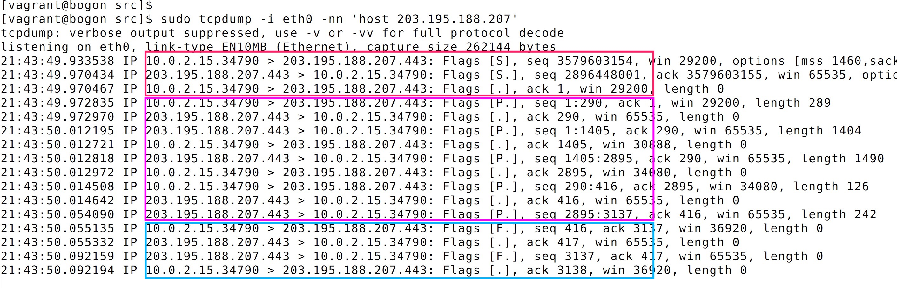

上一节中，我们使用了`openssl`命令行工具做了`ssl`证书的校验实验。本节则在通过代码的方式实践验证

#### SSL handshake 实践

在 [https://justcc.mengkang.net/#/12/01-socket](https://justcc.mengkang.net/#/12/01-socket) 基础连接的基础上，引入`openssl`。

```c
#include <stdio.h>
#include <string.h>
#include <stdlib.h>
#include <sys/socket.h>
#include <netinet/in.h>
#include <netinet/ip.h>		/* superset of previous */
#include <arpa/inet.h>
#include <unistd.h>
#include <netdb.h>
#include <openssl/ssl.h>
#include <openssl/err.h>

int main()
{
	int sockfd = socket(AF_INET, SOCK_STREAM, 0);

	struct sockaddr_in servaddr;
	servaddr.sin_family = AF_INET;
	servaddr.sin_port = htons(443);

	struct hostent *hostent = gethostbyname("static.mengkang.net");
	char *ip = inet_ntoa(*(struct in_addr *)hostent->h_addr_list[0]);

	inet_pton(AF_INET, ip, &servaddr.sin_addr);

	// 建立连接
	connect(sockfd, (struct sockaddr *)&servaddr, sizeof(servaddr));

	SSL_library_init();
	OpenSSL_add_all_algorithms();
	SSL_load_error_strings();

	SSL_CTX *ctx = SSL_CTX_new(SSLv23_client_method());
	SSL *ssl = SSL_new(ctx);
	SSL_set_fd(ssl, sockfd);

	SSL_connect(ssl);
	printf("SSL Connected with %s encryption\n", SSL_get_cipher(ssl));

	// 断开连接
	close(sockfd);

	return 0;
}
```
在编译运行之前，读者可以新开一个终端通过`tcpdump`监听与`static.mengkang.net`（其服务器 `ip` 为`203.195.188.207`）的网络传输
```bash
$ sudo tcpdump -i eth0 -nn 'host 203.195.188.207'
```
#### 引入动态库

之前的代码编译过程中，我们一直只依赖了`glibc`，编译时会默认链接 glibc 动态库。编译时，使用`-l`来**显性连接**依赖的动态库，比如这里我们就依赖了`ssl`和`crypto`动态库

```bash
$ gcc -Wall -std=gnu99 -g -lssl -lcrypto -o https https.c
$ ./https
SSL Connected with ECDHE-RSA-AES256-GCM-SHA384 encryption
```


为什么说是**显性**依赖呢？通过`ldd`命令可以查看依赖的动态库

```bash
ldd ./https
	linux-vdso.so.1 =>  (0x00007fff89dff000)
	libssl.so.10 => /usr/lib64/libssl.so.10 (0x0000003623600000)
	libcrypto.so.10 => /usr/lib64/libcrypto.so.10 (0x00000031ace00000)
	libc.so.6 => /lib64/libc.so.6 (0x0000003b6ae00000)
	libgssapi_krb5.so.2 => /lib64/libgssapi_krb5.so.2 (0x0000003622e00000)
	libkrb5.so.3 => /lib64/libkrb5.so.3 (0x0000003623200000)
	libcom_err.so.2 => /lib64/libcom_err.so.2 (0x0000003622a00000)
	libk5crypto.so.3 => /lib64/libk5crypto.so.3 (0x0000003b70a00000)
	libdl.so.2 => /lib64/libdl.so.2 (0x0000003b6b600000)
	libz.so.1 => /lib64/libz.so.1 (0x0000003b6be00000)
	/lib64/ld-linux-x86-64.so.2 (0x0000003b6aa00000)
	libkrb5support.so.0 => /lib64/libkrb5support.so.0 (0x0000003b72200000)
	libkeyutils.so.1 => /lib64/libkeyutils.so.1 (0x0000003b71200000)
	libresolv.so.2 => /lib64/libresolv.so.2 (0x0000003b6ce00000)
	libpthread.so.0 => /lib64/libpthread.so.0 (0x00000033dbe00000)
	libselinux.so.1 => /lib64/libselinux.so.1 (0x0000003b6c600000)
```

#### 最终代码

通过上节我们知道，在 `HTTPS` 请求过程中，在建立 `TCP` 连接之后，会进行`SSL 握手`，在这个过程中，首先通过非对称加密验证证书的合法性，然后通过通过现有的服务的非对称加密的公钥和密钥再加上随机数，生成一个`会话密钥`。之后，客户端和服务端后面数据的传输使用`会话密钥`加密之后的对称加密的数据。

在这个指导思想之下，我们确定了，需要改进升级的点就是以下三个函数的升级

原始函数 | 新函数
---- | ----
connect | connect + SSL_connect
write | SSL_write
read | SSL_read

`SSL_write`在数据传输之前对本地数据进行一次使用`会话密钥`加密的操作，然后执行`write`；`SSL_read`同理。同时也考虑 `https` 资源和 `http` 资源都需要兼容的情况。最终代码如下

https://gitee.com/zhoumengkang/just-cc/blob/master/code/1803