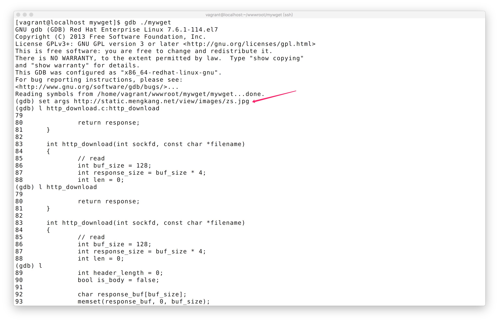
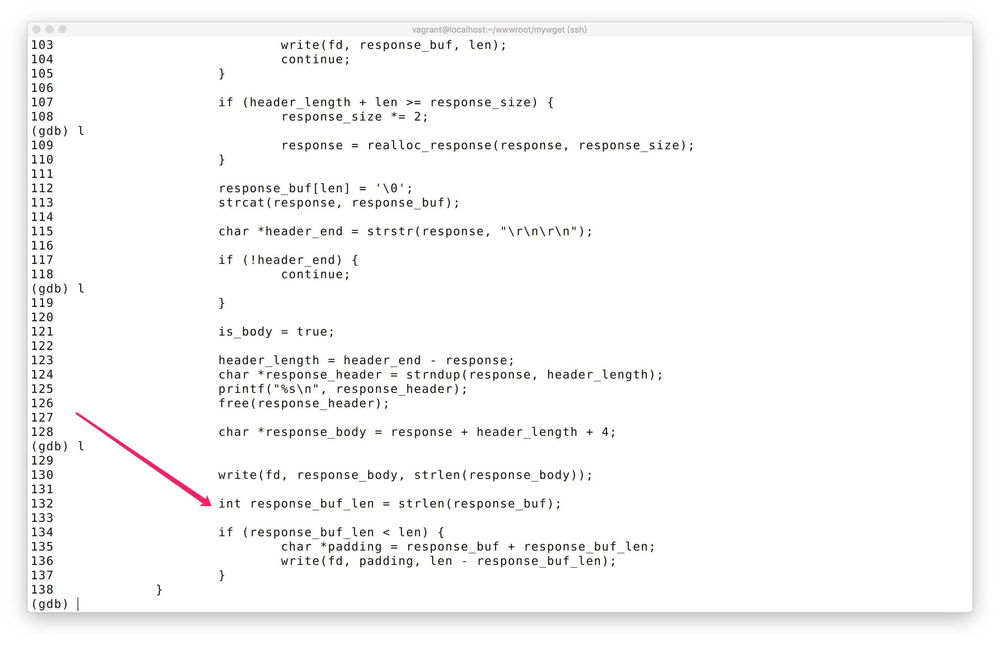
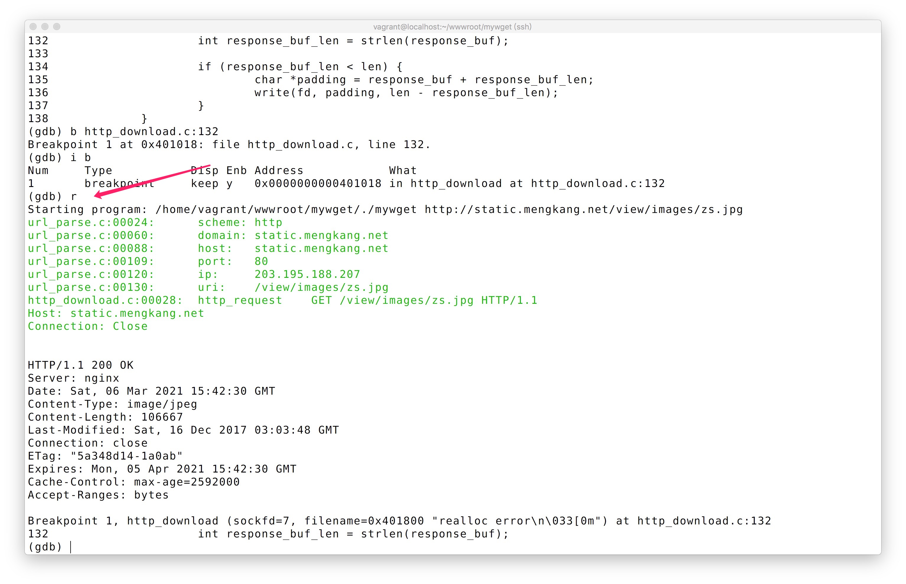
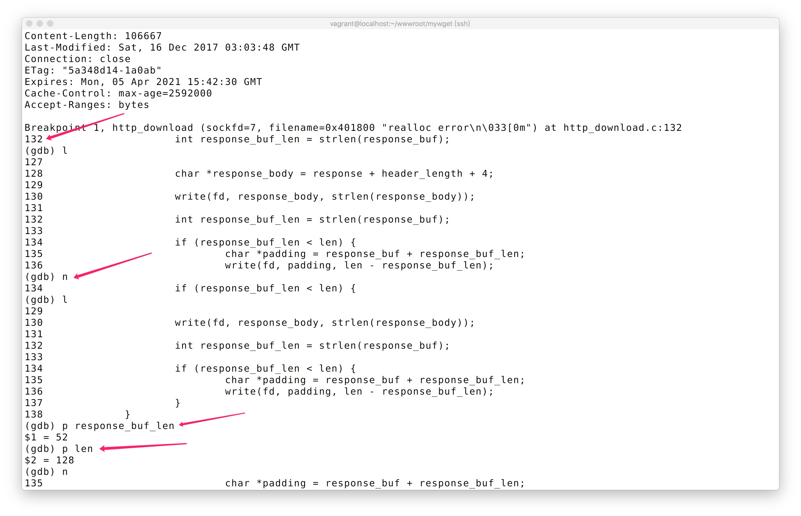

## 什么是 GDB
GDB（GNU symbolic debugger）是 GNU Project 调试器，它使你可以查看另一个程序在“执行”期间正在执行的操作–或该程序崩溃时正在执行的操作。

GDB 可以做四种主要的事情（以及支持这些事情的其他事情）来帮助你捕获行为中的错误：

- 启动你的程序，并指定可能影响其行为的所有内容。
- 使程序在指定条件下停止。
- 检查程序停止时发生的情况。
- 更改程序中的内容，以便你可以尝试纠正一个错误的影响。也就是调试过程中设置修改运行时的变量。

## 启动 GDB 调试的 3 方式
#### 调试可执行文件
比如我们开发的项目
```bash
$ gdb ./mywget
```
#### 调试 core 文件
调试一些因为程序异常退出的`core`文件，配合指定的二进制文件
```bash
$ gdb ./mywget /path/to/coredump/file
```
> https://blog.csdn.net/qq_39759656/article/details/82858101

#### 调试常驻进程
比如调试 mysql 的进程，https://mengkang.net/1336.html
```bash
$ gdb attach pid
```

## 调试通用操作

如果你是一个有一定开发经验的工程师，下面的这些调试操作，就非常的熟悉了，只不过我们都在 IDE 里或者浏览器里，现在换成到 CLI 模式。

> 知乎上的文章挺多，这篇比较短 https://zhuanlan.zhihu.com/p/71519244

### 运行指令

- run（简写r）: 运行程序，当遇到断点后，程序会在断点处停止运行，等待用户输入下一步命令
- continue（简写c） : 继续执行，到下一个断点停止（或运行结束）
- next（简写n） : 单步跟踪程序，当遇到函数调用时，也不进入此函数体；此命令同 step 的主要区别是，step 遇到用户自定义的函数，将步进到函数中去运行，而 next 则直接调用函数，不会进入到函数体内。
- step （简写s）：单步调试如果有函数调用，则进入函数；与命令n不同，n是不进入调用的函数的
- until（简写u）：当你厌倦了在一个循环体内单步跟踪时，这个命令可以运行程序直到退出循环体。
- until+行号： 运行至某行，不仅仅用来跳出循环
- finish： 运行程序，直到当前函数完成返回，并打印函数返回时的堆栈地址和返回值及参数值等信息。
- call 函数（参数)：调用程序中可见的函数，并传递“参数”，如：call gdb_test(55)
- quit（简写q） : 退出gdb

### 设置断点

- break n （简写b n）:在第n行处设置断点（可以带上代码路径和代码名称： b OAGUPDATE.cpp:578）
- b fn1 if a＞b：条件断点设置
- break func（break缩写为b）：在函数func()的入口处设置断点，如：break cb_button
- delete 断点号n：删除第n个断点
- disable 断点号n：暂停第n个断点
- enable 断点号n：开启第n个断点
- clear 行号n：清除第n行的断点
- i b （info breakpoints） ：显示当前程序的断点设置情况
- delete breakpoints：清除所有断点：

### 查看源代码

- list ：简记为 l ，其作用就是列出程序的源代码，默认每次显示10行。
- list 行号：将显示当前文件以“行号”为中心的前后10行代码，如：list 12
- list 函数名：将显示“函数名”所在函数的源代码，如：list main
- list ：不带参数，将接着上一次 list 命令的，输出下边的内容。

### 打印表达式

- print 表达式（简记p）: 其中“表达式”可以是任何当前正在被测试程序的有效表达式，比如当前正在调试C语言的程序，那么“表达式”可以是任何C语言的有效表达式，包括数字，变量甚至是函数调用。
- print a：将显示整数 a 的值
- print ++a：将把 a 中的值加1,并显示出来
- print name：将显示字符串 name 的值
- print gdb_test(22)：将以整数22作为参数调用 gdb_test() 函数
- print gdb_test(a)：将以变量 a 作为参数调用 gdb_test() 函数
- display 表达式：在单步运行时将非常有用，使用display命令设置一个表达式后，它将在每次单步进行指令后，紧接着输出被设置的表达式及值。如： display a
- watch 表达式：设置一个监视点，一旦被监视的“表达式”的值改变，gdb将强行终止正在被调试的程序。如： watch a
- whatis ：查询变量或函数
- info function： 查询函数
- info locals： 显示当前堆栈页的所有变量

### 查询运行信息

- where/bt ：当前运行的堆栈列表；
- bt backtrace 显示当前调用堆栈
- up/down 改变堆栈显示的深度
- set args 参数:指定运行时的参数
- show args：查看设置好的参数
- info program： 来查看程序的是否在运行，进程号，被暂停的原因。

## 实战
启动调试
```bash
$ gdb ./mywget
...
```
需要设置启动参数
```bash
(gdb) set args http://static.mengkang.net/view/images/zs.jpg
```

比如我想看`http_download`函数中之前漏掉的数据那块的逻辑，具体哪一行不清楚了，可以使用`l`命令查看代码，**如果不想经常反复使用`l`，可以使用`gdb -tui`进入图形化界面**
```bash
(gdb) l http_download.c:http_download
```
或者
```bash
(gdb) l http_download
```
继续输入`l`往下翻

输入`r`运行

运行查看实际运行的情况


