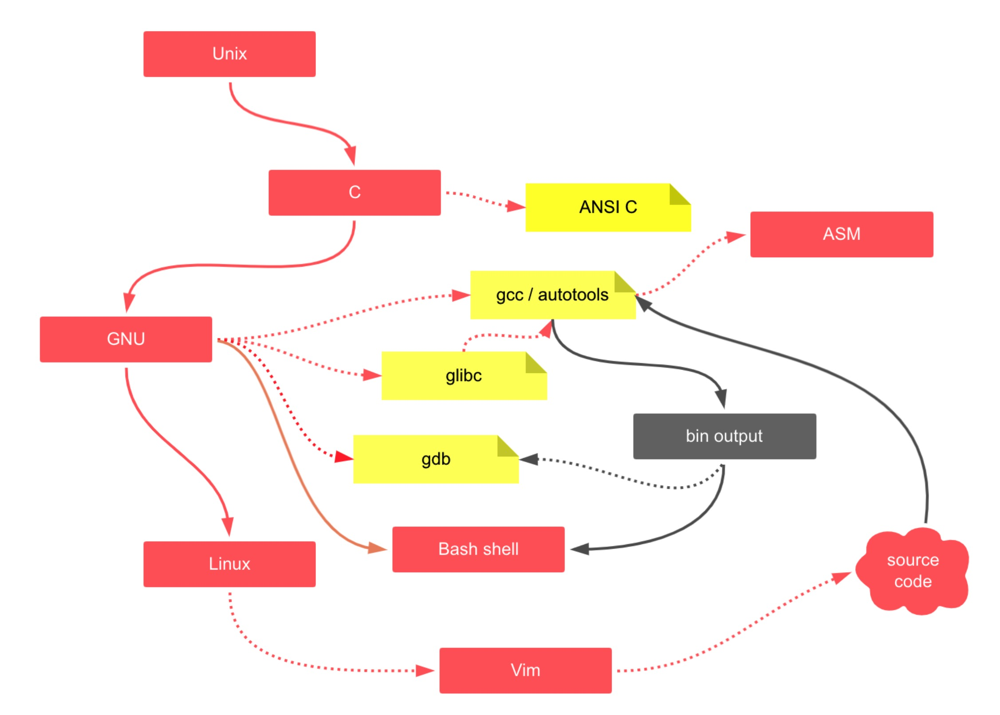

# 前言

## 本书的受众

如果你是一名有开发经验的程序员，对 C 语言语法也有所了解，但是却一直觉得自己没有入门，那么希望这本书能帮你打通 C 语言的任督二脉。

## 本书的定位

它不是一本大而全的书，而是一本打通、衔接各个知识点的书，不适合当手册来查询。

同时一方面很多知识点本书都会省略，比如一些分支语法、循环语法；另一方面很多知识点，我不会循规蹈矩一次讲全，而是结合难度和场景，慢慢学习，大而全不仅很难理解，同时也消耗大家的学习热情。

本书只能是一道**快餐**，好吃的快餐，没有其他书难啃。

## 学习路线图

整体脉络上，以 C 语言的发展历史，并结合 GNU/Linux 生态，从基础到项目实战。最后希望大家通过学习，能对开源软件的基础世界有一个全新的认识。

当然要真正入门成为一名专业的 C 语言开发者，我推荐大家，常备着几本秘籍：

- 《C程序设计语言》做基础入门
- 《C专家编程》、《C陷阱与权限》解开各种困惑
- 《Linux C编程一站式学习》结合操作系统等视角更全面
- 《UNIX 环境高级编程》全面、深入，函数手册全面

欢迎关注我的微信公众号

